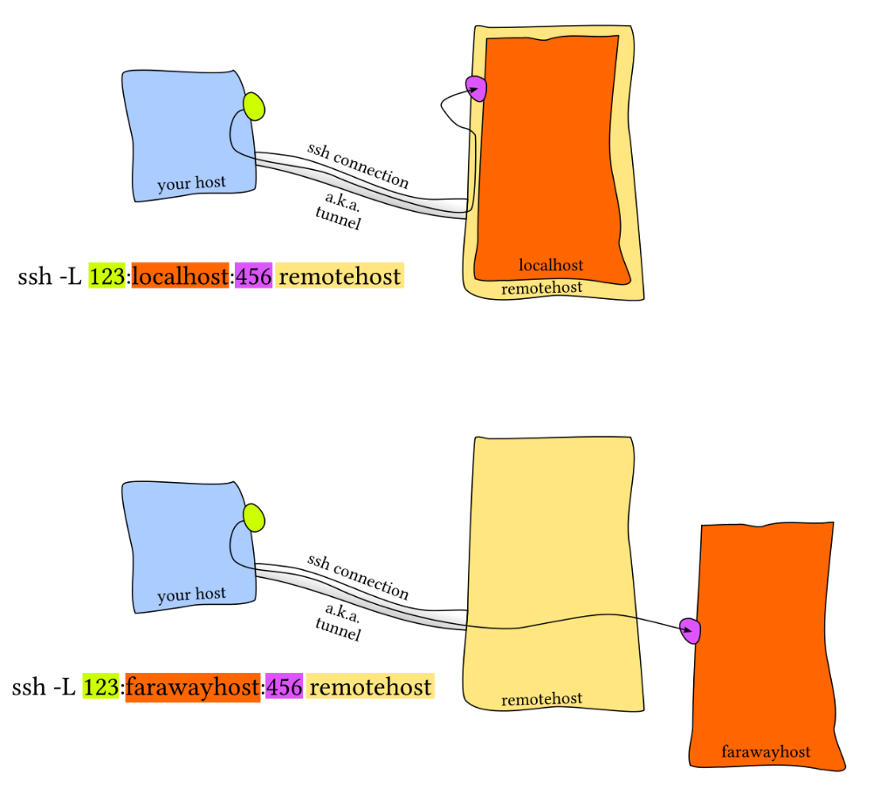
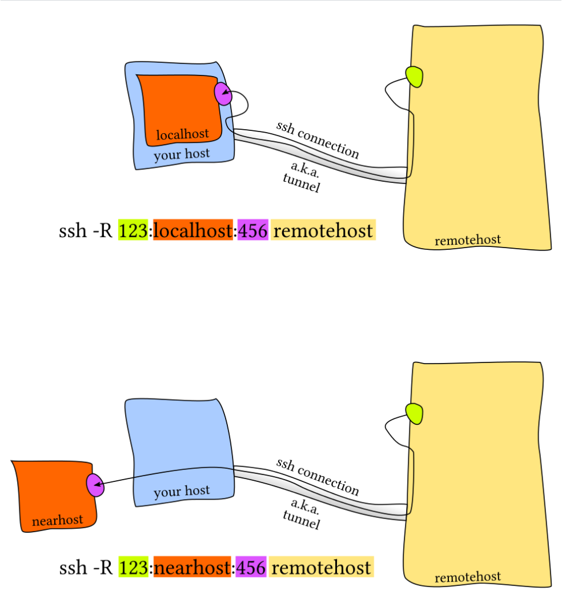

# 命令行环境


---

**Resources：**

[命令行环境 · the missing semester of your cs education](https://missing-semester-cn.github.io/2020/command-line/)

[[自制双语字幕\] 计算机教育缺失的一课(2020) - 第5讲 - 命令行环境_哔哩哔哩_bilibili](https://www.bilibili.com/video/BV1Jh4y1Z7SV?spm_id_from=333.788.videopod.sections&vd_source=4cf1248054c659cc46bc5bafc9e804af)

《深入理解计算机系统CSAPP》

[【大学计算机不会教的知识】Ep.5 远程服务器SSH 端口转发_哔哩哔哩_bilibili](https://www.bilibili.com/video/BV1nk4y1k742/?spm_id_from=333.337.search-card.all.click&vd_source=4cf1248054c659cc46bc5bafc9e804af)

[一文助你打通 tmux - 知乎](https://zhuanlan.zhihu.com/p/102546608)

---


## 一. 软件下载与管理相关

### 1. 软件下载

- 下载安装包自行安装

​	**下载安装包至LInux中，注意先修改安装包的所有者和可执行权限，再执行安装**

- 系统的 "应用商店" 安装

**Linux apt 命令：**

apt（Advanced Packaging Tool）是一个在 Debian 和 Ubuntu 中的 Shell 前端软件包管理器。

> 1. APT概念
>    APT(Advanced Packaging Tool，高级软件包管理工具)是一个用于管理Debian系Linux发行版软件包的工具，可以视其为另一工具dpkg的前端，操作管理更方便，对Linux运维人员具有重要意义。
>    通常来说，由于APT是用于管理软件包的，故大量操作都需要基于sudo（超级用户权限）下操作。
>
> 2. APT历史
>    简单来说，就是最初的GNU/Linux系统只有.tar.gz打包源码提供给Linux用户自行编译安装的这种安装软件包的方式，太麻烦，于是Debian就搞了dpkg这样的一个可以安装.deb软件包的工具，但是处理依赖太麻烦，Debian就又搞出来APT这个既可以很方便处理依赖，又可以很方便从服务器下载软件包安装的程序。
>
> 3. APT的原理
>
>    Ubuntu采用集中式的软件仓库机制，将各式各样的软件包分门别类地存放在软件仓库中，进行有效地组织和管理。然后，将软件仓库置于许许多多的镜像服务器中，并保持基本一致。这样，所有的Ubuntu用 户随时都能获得最新版本的安装软件包。因此，对于用户，这些镜像服务器就是他们的软件源（Reposity）。
>
>    但那些镜像站点具体都拥有什么软件资源并不清楚。若每安装一个软件包，就在服务器上寻找一遍，效率是很低的。因而，就有必要为这些软件资源列个清单（建立索引文件），以便本地主机查询。
>
>    服务器会分析自己所有deb包，根据它们的依赖生成一个索引文件，客户端的APT就负责下载这个索引，然后每次安装东西就会去本地的索引查找依赖，然后一次性去服务器下载下来按照特定顺序安装。本地的索引很容易过期，因此每次使用APT之前最好还是更新一下。
>
> 4. APT的服务器
>    那世界上这么多服务器，APT怎么知道找哪个呢？由于每位用户所处的网络环境不同，不可能随意地访问各镜像站点，为了能够有选择地访问，在Ubuntu系统中服务器的地址是被储存在/etc/apt/sources.list文件和/etc/apt/sources.list.d文件夹下面的.list文件中，说白了每次APT更新索引时都会去这一堆 .list 文件里面找服务器，再去服务器下载索引。同时，这些提供.deb和索引的服务器就被称为通常意义上的镜像源。
>
>    ————————————————

apt 命令提供了查找、安装、升级、删除某一个、一组甚至全部软件包的命令，而且命令简洁而又好记。

apt 命令执行需要超级管理员权限(root)。

 ```shell
[sudo] apt [options] command package
# options：可选，选项包括 -h（帮助），-y（当安装过程提示选择全部为"yes"），-q（不显示安装的过程）等等
# command：要进行的操作
# package：安装的包名
 ```

#### apt 常用命令

- 连接软件源，列出所有可更新的软件清单命令(每次使用apt下载前最好都更新一下)：**sudo apt update**

- 升级软件包：**sudo apt upgrade**

  列出可更新的软件包及版本信息：**apt list --upgradable**

  升级所有软件包（包括内核），升级前先删除需要更新软件包：**sudo apt full-upgrade**

- 安装指定的软件命令：**sudo apt install <package_name>**

  安装多个软件包：**sudo apt install <package_1> <package_2> <package_3>**

- 更新指定的软件命令：**sudo apt update <package_name>**

- 显示软件包具体信息,例如：版本号，安装大小，依赖关系等等：**sudo apt show <package_name>**

- 删除软件包命令：**sudo apt remove <package_name>**

- xxxxxxxxxx4 1# On Linux2sudo strace -e lstat ls -l > /dev/null3# On macOS4sudo dtruss -t lstat64_extended ls -l > /dev/nullbash

- 查找软件包命令： **sudo apt search <keyword>**

- 列出所有已安装的包：**apt list --installed**

- 列出所有已安装的包的版本信息：**apt list --all-versions**

#### apt安装软件包的位置

1. 软件包缓存位置：安装时下载的软件包会被存储在 /var/cache/apt/archives 目录中。这些文件是*.deb*格式的安装包，用于安装或更新软件。

2. 二进制可执行文件：通常安装在 /usr/bin/ 目录下。这是存放系统级命令和应用程序的目录，所有用户都可以访问。

3. 库文件：通常安装在 /usr/lib/ 或 /usr/lib/x86_64-linux-gnu/ 目录下（后者针对64位系统）。这些目录存放共享库文件，供系统中的程序使用。

4. 源代码文件：如果安装的是开发包（以`-dev`结尾的软件包），源代码文件通常被安装在`/usr/include/`目录下。

5. 配置文件：通常安装在 /etc/ 目录下。这是存放系统级配置文件的目录，用于配置软件包的运行参数和行为。

6. 文档和手册页：通常安装在 /usr/share/man/、/usr/share/doc/ 等目录下。这些目录存放软件包的帮助文档和手册页，供用户查阅。

7. 其他文件：根据软件包的不同，可能还会有其他类型的文件安装在 /usr/share/ 目录下。例如，字体文件、图标文件等。

### 2. 打包与压缩

不同操作系统常用的打包压缩方式不同：

- Windows常用`rar`格式
- Mac常用`zip`格式
- Linux常用`tar.gz`格式

#### 2.1. 打包 / 解包

tar是Linux中常用的打包备份工具，此命令可以把一系列文件打包到一个大文件夹中，也可以把一个打包的大文件恢复成一系列文件

```shell
# 打包文件
tar -cvf 打包文件.tar 被打包的文件路径（若是多个文件用空格分隔）
# 解包文件
tar -xvf 打包文件.tar
```


---


```bash
tar [options] 生成的归档文件.tar 要打包的文件或目录...
# -c : Create，创建新的归档文件。（打包时必选）
# -x : Extract，从归档文件中提取文件。（解包时必选）
# -f : File，指定归档文件的文件名。（必选，后面必须紧跟归档文件名）
# -v : Verbose，显示操作的详细过程（输出文件列表）。
# -t : List，列出归档文件中的内容（不解包）。
# -z : 通过 gzip 过滤归档文件（即使用 gzip 进行压缩或解压），对应 .tar.gz 或 .tgz。
# -j : 通过 bzip2 过滤归档文件，对应 .tar.bz2 或 .tbz。
# -J : 通过 xz 过滤归档文件，对应 .tar.xz 或 .txz。
# -C : 解压到指定目录。
```


---


#### 2.2. 压缩 / 解压缩

tar与gzip结合使用可以实现文件的打包与压缩

- `tar`只负责打包文件，但不压缩
- 用`gzip`可以压缩`tar`打包后的文件，其扩展名一般为`xxx.tar.gz`
- 在`tar`命令中有一个选项`-z`可以调用`gzip`，从而方便的实现打包压缩功能

```shell
# 压缩文件
tar -zcvf 打包文件.tar.gz 被打包的文件路径（若是多个文件用空格分隔）
# 解压缩文件
tar -zxvf 打包文件.tar.gz
```

---

inux主要有三种压缩方式：

1. gzip：是公认的压缩这速度最快，压缩大文件的时候与其他的压缩方式相比更加明显，历史最久，应用最广泛的压缩方式
2. bzip：压缩形成的文件小，但是可用性不如gzip
3. xz：是最新的压缩方式，可以自动提供最佳的压缩率

| 压缩格式  | 扩展名            | 压缩比/速度      | 调用参数 |
| --------- | ----------------- | ---------------- | -------- |
| **Gzip**  | `.tar.gz` `.tgz`  | 平衡             | -z       |
| **Bzip2** | `.tar.bz2` `.tbz` | 比 Gzip 高，更慢 | -j       |
| **XZ**    | `.tar.xz` `.txz`  | 最高，最慢       | -J       |


---


#### 2.3. 使用其他压缩工具

1. `zip` / `unzip`

   **特点**：在 Windows 和 Linux 之间通用的常见格式。

   ```bash
   # 压缩 (-r 表示递归目录)
   zip -r archive.zip file1.txt directory/
   
   # 查看压缩包内容
   unzip -l archive.zip
   
   # 解压
   unzip archive.zip
   
   # 解压到指定目录
   unzip archive.zip -d /target/directory
   ```

2. `gzip`, `bzip2`, `xz` (单独使用)

   这些命令通常只用于压缩**单个文件**，因为它们不能处理目录。

   ```bash
   # 压缩单个文件 (原文件会被删除，生成 file.txt.gz)
   gzip file.txt
   bzip2 file.txt   # -> file.txt.bz2
   xz file.txt      # -> file.txt.xz
   
   # 解压单个文件
   gunzip file.txt.gz
   bunzip2 file.txt.bz2
   unxz file.txt.xz
   
   # 保留原文件进行压缩
   gzip -c file.txt > file.txt.gz
   ```


#### 2.4. 高级技巧与常用选项

- 排除文件(`--exclude`)

  ```bash
  tar -czvf backup.tar.gz --exclude='*.tmp' --exclude='cache/' directory/
  ```

- 使用通配符

  ```bash
  tar -czvf photos.tar.gz *.jpg
  ```

- 保留权限 (`-p`)：在创建和解压时保留文件的原始权限和属性（对于备份系统文件很重要）

  ```bash
  tar -czpvf backup.tar.gz /etc
  tar -xzpf backup.tar.gz
  ```

- 分卷压缩：先将大文件打包压缩，然后用 `split` 命令分割。

  ```bash
  # 创建分卷压缩包 (每个部分 100M)
  tar -czvf - big_directory/ | split -b 100M - big_backup.tar.gz.part
  
  # 合并并解压
  cat big_backup.tar.gz.part* | tar -xzvf -
  ```

  


### 3. 环境变量

在使用Linux内置命令时（如ls），我们知道实际上是在执行一个程序（/usr/bin/ls），但为何无论当前在哪个工作目录下，都能执行这个程序呢？

这就是环境变量的作用。

其实，类似于 Python 或 Ruby，shell 是一个**编程环境**，所以它具备变量、条件、循环和函数。当你在 shell 中执行命令时，您实际上是在执行一段 shell 可以解释执行的简短代码。如果你要求 shell 执行某个指令，但是该指令并不是 shell 所了解的编程关键字，那么它会去咨询 *环境变量* `$PATH`，它会列出当 shell 接到某条指令时，进行程序搜索的路径：

```shell
# 查看当前系统中记录的环境变量
env
# 查看PATH环境变量	$符号用于取“变量”的值
echo $PATH
```

环境变量中的`PATH` 变量记录了系统或终端执行任何命令的搜索路径（Linux中以冒号分隔），当执行任何命令，都会按照顺序，从`PATH`中搜索要执行程序的本体。

e.g. 当我们执行 `echo` 命令时，shell 了解到需要执行 `echo` 这个程序，随后它便会在 `$PATH` 中搜索由 `:` 所分割的一系列目录，基于名字搜索该程序。当找到该程序时便执行（假定该文件是 *可执行程序*）。确定某个程序名代表的是哪个具体的程序，可以使用 `which` 程序。我们也可以绕过 `$PATH`，通过直接指定需要执行的程序的路径来执行该程序.

```bash
$ which echo
/bin/echo
$ /bin/echo $PATH
/usr/local/sbin:/usr/local/bin:/usr/sbin:/usr/bin:/sbin:/bin

# 但实际上有些shell中echo是内建命令，不需要搜索PATH也可执行。
$ type echo
echo is a shell builtin
```

>  终端执行程序的逻辑：
>
>  若用户输入绝对路径或使用了特殊路径符，则直接按路径去执行该程序
>
>  若用户输入相对路径，终端会在`PATH`中搜索路径以搜索程序位置；因此内置命令直接输入名字就能执行，而我们自己的程序路径若不在`PATH`中，即使在对应目录下直接输入名字也不会执行
>
>  ```shell
>  # 想执行/home/me/a.out程序
>  # 目前已进入/hoeme/me目录，在当前工作目录中输入
>  a.out	# 不执行，a.out: command not found
>  ./a.out	#执行
>  ```
>
>  

当然，除了`PATH`变量以外，一般还有一些其他变量：

| 环境变量名              | 主要作用                                       | 典型值示例                     |
| :---------------------- | :--------------------------------------------- | :----------------------------- |
| **PATH**                | 指定系统搜索**可执行命令**的目录路径           | `/usr/local/bin:/usr/bin:/bin` |
| **HOME**                | 指明当前用户的**家目录**                       | `/home/username`               |
| **SHELL**               | 指定当前用户使用的**默认 Shell**               | `/bin/bash`                    |
| **PWD**                 | 指示**当前工作目录** (Print Working Directory) | `/tmp`                         |
| **LANG** / **LANGUAGE** | 设置系统的**默认语言和区域**（如字符编码）     | `zh_CN.UTF-8`, `en_US.UTF-8`   |
| **USER** / **LOGNAME**  | 记录当前登录的**用户名**                       | `your_username`                |
| **PS1**                 | 定义 Shell **主提示符的格式**                  | `[\u@\h \W]\$`                 |
| **LD_LIBRARY_PATH**     | 指定**动态链接库**（.so 文件）的搜索路径       | `/usr/local/lib`               |
| **TMP** / **TMPDIR**    | 指定应用程序存放**临时文件**的目录             | `/tmp`                         |

这些环境变量影响着系统和应用的方方面面：

- **程序执行**：`PATH` 决定了系统在哪里寻找命令。
- **用户配置**：`HOME`, `SHELL` 等保存了用户的工作环境和偏好。
- **系统配置**：`LANG` 等变量定义了系统语言、字符集等。

#### 自行设置环境变量

Linux环境变量可以用户自行设置

- 临时设置 在终端中直接执行

```shell
# 配置环境变量语法为
export 变量名=变量值
```

- 永久生效 在配置文件中设置
  - 若要针对当前用户生效，配置在`~/.bashrc`文件中
  
    `echo 变量名=变量值 >> ~/.bashrc`
  
  - 若要针对所有用户生效，配置在`/etc/profile`文件中
  
  - 配置后通过执行`source 配置文件`刷新终端，即可生效

追加`PATH`变量

```shell
export PATH=$PATH:路径
# 对PATH变量赋值，等号右侧意思为在PATH原有值的基础上，再加上“ :路径 ”这个值，这样做会追加PATH变量的值，而不会重新赋值覆盖掉PATH原有的值
```


#### `env`命令

env 是 Linux/Unix 系统中一个非常实用的命令行工具，主要用于

1. 打印当前shell会话中的所有环境变量  `env`

2. 在一个自定义环境中运行程序

   可以在运行一个命令之前，临时设置、修改或删除一些环境变量。**这些修改只对这次运行的命令有效，不会影响当前的 shell 环境**。（类似于创建一个临时的仅用于运行某个命令的虚拟环境，实际上“conda虚拟环境”的本质就是临时更改了shell的环境变量`PATH`）

```bash
env [options] [NAME=VALUE] [COMMAND]
# options:
# -i, --ignore-environment: 从一个空环境开始，忽略继承的环境变量（纯净启动）
# -u NAME, --unset=NAME: 从环境中删除指定的变量NAME
# -C DIR, --chdir=DIR: 在运行命令前切换到指定目录DIR
# 不加任何选项与参数默认输出当前shell中所有的环境变量
```

---


## 二. 命令行环境管理

### 1. 任务控制 / 进程管理

`sleep`命令：Linux sleep命令可以用来将目前动作延迟一段时间

```shell
sleep [--help] [--version] number[smhd]
# --help : 显示辅助讯息
# --version : 显示版本编号
# number : 时间长度，后面可接 s、m、h 或 d
# 其中 s 为秒，m 为 分钟，h 为小时，d 为日数，不加默认为秒
```

**查看进程资源：**可以使用ps，pstree，top，htop，pgrep等命令查看进程资源，命令具体详见 “调试及性能分析” 笔记。

**结束进程：**

情景：执行`sleep`命令后，不想再等待，停止执行该命令，怎么做？

使用`ctrl + c`快捷键中止，那么为什么它能中止一个命令 / 程序 运行？

 shell 会使用 UNIX 提供的信号机制执行进程间通信。当一个进程接收到信号且程序中没有特殊处理该信号的操作时，则会执行该信号的默认操作，程序会停止执行、处理该信号并基于信号传递的信息来改变其执行。就这一点而言，信号是一种 *软件中断* 机制。


---

**Summary：**


默认行为可以总结为：

- 进程终止
- 进程终止并转储存储器（dump core）
- 进程暂停，直到被SIGCONT信号重启
- 进程忽略该信号

---


在上面的例子中，当我们输入 `Ctrl-C` 时，shell 会发送一个 `SIGINT` （INT：interrupt）信号到进程。

*特殊处理该信号的操作* ：例如使用python，有一个signal库，里面的函数signal即可处理信号SIGINT等信号。

> 常用的终止程序相关的请求信号及发出该信号对应的快捷键：
>
> 2) SIGINT
>
> 程序终止(interrupt)信号, 在用户键入INTR字符(通常是`ctrl + C`)时发出，用于通知前台进程组终止进程。
>
> 3) SIGQUIT
>
> 和SIGINT类似, 但由QUIT字符(通常是`ctrl + \`快捷键)来控制. 进程在因收到SIGQUIT退出时会产生core文件, 在这个意义上类似于一个程序错误信号。
>
> 15) SIGTERM
>
> 程序结束(terminate)信号, 与SIGKILL不同的是该信号可以被阻塞和处理。通常用来要求程序自己正常退出，shell命令kill缺省产生这个信号。如果进程终止不了，我们才会尝试SIGKILL。
>
> 同时，`SIGTERM` 则是一个更加通用的、也更加优雅地退出信号。为了发出这个信号我们需要使用 `kill` 命令, 它的语法是：
>
> ```shell
> kill -TERM <PID>
> kill <PID>
> # kill命令缺省默认产生SIGTERM信号，但如果使用它进程中止不了，会尝试使用SIGKILL信号
> ```
>
> 
>
> 19) SIGSTOP
>
> 停止(stopped)进程的执行. 注意它和terminate以及interrupt的区别:该进程还未结束, 只是暂停执行. 本信号不能被阻塞, 处理或忽略.
>
> 9. SIGKILL
>
> 当前进程收到该信号,注意该信号不是由终端发送的，而是由内核直接发送的，程序无法捕获它,也就是说进程无法执行信号处理程序,会直接发送默认行为,也就是直接退出.这也就是为何`kill -9 pid`一定能杀死程序的原因. 故这也造成了进程被结束前无法清理或者关闭资源等行为,这样是不好的.

**发送信号的方式：**

**内核检测到一个系统事件，比如除零错误或者子进程终止，因此内核要更新目的进程上下文中的某个状态（异常控制流），发送一个信号给目的进程。这种发送信号的机制是基于“进程组”而非单个进程的。**

1. 使用库函数。如`kill`, `alarm`函数等。

2. **从键盘发送信号**：例如，从键盘上输入`Ctrl+C`会导致内核发送一个`SIGINT`信号到前台进程组中的每个进程。

3. **kill命令**

```bash
kill 命令可以发送不同的信号给目标进程，来实现不同的操作，如果不指定信号，默认会发送 TERM 信号（15），即终止。若仍无法终止该程序，可使用 SIGKILL(9) 信息尝试强制删除程序。
kill [options] <PID>
# <PID> 是要终止进程的进程 ID
# options：
# -l：列出所有可用的信号
#以下几种选项或选项+参数均可制定信号：
# (1) -<signal>  带 SIG 前缀，例如：kill -SIGKILL 1234
# (2) -<signal>  不带SIG前缀，例如：kill -KILL 1234
# (3) -<num>  使用信号的编号，例如：kill -9 1234
# (4) -s <signal>  -s选项用于指定要发送的信号名称,例如：kill -s SIGKILL 1234 
```

e.g. 

```bash
# 终止 PID 为 1234 的进程：
kill 1234
# 强制终止 PID 为 1234 的进程：
kill -9 1234
# 向 PID 为 1234 的进程发送 SIGSTOP：
kill -s SIGSTOP 1234
```

**kill相关命令**：

- `killall`:使用进程的名称（而不是PID）来发送信号，这对于不知道PID但知道确切进程名的场景非常方便。

```bash
killall [options] [signal] <进程名>
# options：
# -e, --exact：要求进程名必须精确匹配（对于长进程名很有用）。
# -i, --interactive：交互模式，在杀死每个进程前询问确认。
# -r, --regexp：使用扩展正则表达式来匹配进程名，而不是默认的精确匹配。
# -u, --user：只终止属于指定用户的进程。
# -I, --ignore-case：忽略进程名的大小写。
# -o, --older-than：只终止运行时间比指定时间长的进程。
# -y, --younger-than：只终止运行时间比指定时间短的进程。
# -<signal>：指定发送的信号

e.g.
# 1. 正常终止所有名为 "firefox" 的进程
killall firefox

# 2. 强制终止所有名为 "chrome" 的进程
killall -9 chrome
killall -SIGKILL chrome

# 3. 交互式地终止所有名为 "some_script" 的进程（会问你 Y/N）
killall -i some_script

# 4. 终止用户 "alice" 的所有 "nginx" 进程
killall -u alice nginx

# 5. 使用正则表达式终止所有以 "python3" 开头的进程（如 python3-script）
killall -r '^python3'
```

---

Question：`killall`的`-e`选项有什么用？？？

**`-e` 或 `--exact` 选项的作用是：要求进程名必须与提供的名称进行更长、更严格的精确匹配。**

这听起来可能有点绕，因为我们已经知道 `killall` 默认就是*精确匹配*。为了理解 `-e` 的用途，我们需要先理解 Linux 中“进程名”的一个特点。

**核心区别：进程名长度限制**

在 Linux 系统中，进程名（存储在 `/proc/<PID>/stat` 中）的长度是有限制的（通常为 15 或 16 个字符）。如果启动一个进程的命令行很长，系统会**自动截断**这个命令行，用截断后的结果作为进程名。

- 默认的 `killall`（无 `-e`）：只比较这个**被截断后的、短的进程名**。
- 使用 `killall -e`：它不仅比较进程名，还会去检查完整的命令行（`/proc/<PID>/cmdline`），要求**完整的命令行必须与你提供的名字精确匹配**。

**举例说明**

假设我们通过一个非常长的路径和参数启动了一个脚本：

```bash
/opt/my_applications/scripts/very_long_name_process.sh --config /home/user/config.cfg
```

由于进程名长度限制，系统会将其截断。用 `ps` 命令查看时，你可能会看到：

```bash
$ ps aux | grep very_long
user     12345  0.0  0.1 12345 6780 pts/0    S    10:00   0:00 very_long_name_
```

注意：进程名被截断成了 `very_long_name_`（15个字符）。

**场景一：使用默认 `killall`（无 `-e`）**

```bash
killall very_long_name_
```

这条命令会成功，因为它匹配的是被截断后的进程名 `very_long_name_`。

**但是，如果你不知道进程名被截断了，尝试用完整的脚本名来终止它：**

```bash
killall very_long_name_process.sh
```

这条命令会失败，并提示 `No process found`，因为被截断的进程名 (`very_long_name_`) 和你提供的完整名称 (`very_long_name_process.sh`) 不匹配。

**场景二：使用 `killall -e`（有 `-e`）**

```bash
killall -e very_long_name_process.sh
```

这条命令会**成功**！`-e` 选项告诉 `killall`：“不要只看那个被截断的短名字，去检查完整的命令行，如果完整命令行匹配 `very_long_name_process.sh`，就终止它。”

即使进程列表里显示的是 `very_long_name_`，`killall -e` 也能通过完整路径找到并杀死它。


---


- `pkill`:用模式匹配进程名或其他属性（如用户名、终端等）来发送信号。它是 `pgrep` 的“杀手版”，功能最强大、最灵活。

```bash
pkill [options] [signal] <模式>
# 这里的 <模式> 是一个模式匹配表达式(通配符 & 正则表达式)，默认会匹配进程名
# options:
# -f, --full：默认只匹配进程名。加上 -f 后，会匹配整个命令行（包括参数）。这个非常有用！
# 例如，你运行了 python3 app.py，用 pkill python3 会杀死所有 Python3 进程，而 pkill -f app.py 则只杀死运行这个特定脚本的进程。

# -u, --euid：匹配有效用户ID或用户名的进程。
# -t, --terminal：匹配指定终端（tty）的进程。例如 -t pts/0 杀死来自第一个终端窗口的所有进程。
# -x, --exact：要求进程名必须与模式精确匹配（类似 killall -e）。
# -n, --newest：只杀最新（最近启动的）的匹配进程。
# -o, --oldest：只杀最旧（最早启动的）的匹配进程。
# -<signal>：指定要发送的信号。

e.g.
# 1. 终止所有进程名中包含 "chrome" 的进程（比 killall 更灵活）
pkill chrome

# 2. 强制终止用户 "bob" 的所有进程
pkill -9 -u bob

# 3. 终止在 tty1 终端上运行的所有进程
pkill -t tty1

# 4. 【经典用法】终止一个特定的 Java 应用，而不杀死其他 Java 进程
# 假设启动命令是：java -jar myapp.jar
pkill -f 'myapp.jar'

# 5. 只终止最老的那个 Python 进程
pkill -o python
```


另外，`exit()` 函数，return语句和进程终止信号都可以用来结束进程，但它们的工作原理和用途有所不同。`exit()` 函数是一个库函数，return语句是C语言内置语句，用于正常地终止当前进程；而进程终止信号是一种异步事件，可以由操作系统、其他进程或用户发送给目标进程。

```shell
exit [n]
# exit命令在图形化终端没有选项，在脚本中只接受一个可选的参数[n]，这个参数表示退出状态。这个状态码可以用来表明程序是正常退出还是因为某种错误或异常而退出。这是一个介于0和255之间的整数。以下是一些常见的退出状态代码及其含义:
0: 命令成功执行，没有错误。
1: 通用错误。这是最常用的退出代码，应该被用作各种杂项错误的捕获值。
2: shell内置命令的无效使用。内置命令的例子包括alias，echo，和printf。
126: 无法执行命令。这可能是因为权限问题或者命令不可执行。
127: 找不到命令。这可能是因为拼写错误或者PATH问题。
128+n: 程序在接收到一个信号后终止，它将返回一个等于128 + 信号编号的错误代码。例如，当我们通过键入Control-C终止一个程序时，我们实际上向它发送了一个SIGINT信号。这个信号的值是2。因此，程序将停止执行并返回一个值为128 + 2 = 130的退出代码。
```


**暂停和后台执行进程：**

信号可以让进程做其他的事情，而不仅仅是终止它们。例如，`SIGSTOP` 会让进程暂停。

从程序员的角度，我们可以认为进程总是处于以下三种状态之一：

- 运行：要么在CPU运行，要么等待被执行且最终会被内核调度
- 停止：进程的执行被挂起（停止），且不会被内核调度，直到它收到SIGCONT信号
- 终止：进程永远地停止了，停止原因有三种：收到一个信号，该信号默认行为是终止进程；从主程序return返回；调用exit函数

在终端中，键入 `Ctrl-Z` 会让 shell 发送 `SIGTSTP` 信号，`SIGTSTP` 是 Terminal Stop 的缩写（即 `terminal` 版本的 SIGSTOP），它会让已经在运行的进程暂停，并挂到后台。

我们可以使用 [`fg`](https://www.man7.org/linux/man-pages/man1/fg.1p.html) 或 [`bg`](http://man7.org/linux/man-pages/man1/bg.1p.html) 命令恢复暂停的工作。它们分别表示在前台继续或在后台继续。（注：一个终端内前台只能运行一个进程，后台可以运行若干个）

> 如何查看后台运行的进程任务？
>
> [`jobs`](http://man7.org/linux/man-pages/man1/jobs.1p.html) 命令会列出当前终端会话中尚未完成的全部任务。您可以使用 pid 引用这些任务（也可以用 [`pgrep`](https://www.man7.org/linux/man-pages/man1/pgrep.1.html) ，ps等找出 pid）。更加符合直觉的操作是您可以使用百分号 + 任务编号（`jobs` 会打印任务编号）来选取该任务。如果要选择最近的一个任务，可以使用 `$!` 这一特殊参数。
>
> 还有一件事情需要掌握，那就是命令中的 `&` 后缀可以让命令在直接在后台运行，这使得您可以直接在 shell 中继续做其他操作，不过它此时还是会使用 shell 的标准输出，这一点有时会比较恼人（这种情况可以使用 shell 重定向处理）。
>
> 让已经在运行的进程转到后台运行，您可以键入 `Ctrl-Z` ，然后紧接着再输入 `bg`。注意，后台的进程仍然是您的终端进程的子进程，一旦您关闭终端（会发送另外一个信号 `SIGHUP`），这些后台的进程也会终止。为了防止这种情况发生，您可以使用 [`nohup`](https://www.man7.org/linux/man-pages/man1/nohup.1.html)（一个用来忽略 `SIGHUP` 的封装）来运行程序。针对已经运行的程序，可以使用 `disown` 。但`nohup`有一些缺点，如输出被定向到一个文件`nohup.out`，并且运行过程中不能能对它进行任何操作，如输入等。因此，有更好的替代方案，就是使用终端多路复用器来实现。

```shell
jobs [-l -n -p -r -s]
#-l:显示进程号（process ID）
#-n:只显示上次shell通知后改变了状态的作业
#-p:只显示进程号
#-r:只显示正在运行的作业
#-s:只显示已停止的作业
```


### 2. 终端多路复用器

**tmux程序**

tmux是一个命令行，Linux命令在其中仍可使用，快捷键不可直接使用，需要先按一个前缀`ctrl + b`，然后再加快捷键，且快捷键不需要再加`ctrl`。

如`ctrl + b`，再点`d`,可以退出tmux服务器，然后我们可以再进入（命令`tmux a`）这个tmux服务器命令行会话，里面的数据不会被清除。因此即使外部终端shell断掉了，tmux中的数据依然会保留。

另外，还可以在tmux中创建新的命令行，`ctrl + b` +`c`，就像浏览器中的多个 tag页面 一样，并且可以把一个窗口分屏。

***==摘自 missing-semester-cn==***

当您在使用命令行时，您通常会希望同时执行多个任务。举例来说，您可以想要同时运行您的编辑器，并在终端的另外一侧执行程序。尽管再打开一个新的终端窗口也能达到目的，使用终端多路复用器则是一种更好的办法。

像 [`tmux`](https://www.man7.org/linux/man-pages/man1/tmux.1.html) 这类的终端多路复用器可以允许我们基于面板和标签分割出多个终端窗口，这样您便可以同时与多个 shell 会话进行交互。

不仅如此，终端多路复用使我们可以分离当前终端会话并在将来重新连接。

这让您操作远端设备时的工作流大大改善，避免了 `nohup` 和其他类似技巧的使用。

现在最流行的终端多路器是 [`tmux`](https://www.man7.org/linux/man-pages/man1/tmux.1.html)。`tmux` 是一个高度可定制的工具，您可以使用相关快捷键创建多个标签页并在它们间导航。

`tmux` 的快捷键需要我们掌握，它们都是类似 `<C-b> x` 这样的组合，即需要先按下 `Ctrl+b`，松开后再按下 `x`。`tmux` 中对象的继承结构如下：

- **会话(sessions)** - 每个会话都是一个独立的工作区，其中包含一个或多个窗口
  - `tmux` 开始一个新的会话
  - `tmux new -s NAME` 以指定名称开始一个新的会话
  - `tmux ls` 列出当前所有会话
  - 在 `tmux` 中输入 `<C-b> d` ，将当前会话分离
  - `tmux a` 重新连接最后一个会话。您也可以通过 `-t` 选项来指定具体的会话
- **窗口(windows)** - 相当于编辑器或是浏览器中的标签页，从视觉上将一个会话分割为多个部分
  - `<C-b> c` 创建一个新的窗口，使用 `<C-d>` 关闭
  - `<C-b> N` 跳转到第 *N* 个窗口，注意每个窗口都是有编号的
  - `<C-b> p` 切换到前一个窗口
  - `<C-b> n` 切换到下一个窗口
  - `<C-b> ,` 重命名当前窗口
  - `<C-b> w` 列出当前所有窗口
- **面板(panes)** - 像 vim 中的分屏一样，面板使我们可以在一个屏幕里显示多个 shell
  - `<C-b> "` 水平分割
  - `<C-b> %` 垂直分割
  - `<C-b> <方向>` 切换到指定方向的面板，<方向> 指的是键盘上的方向键
  - `<C-b> z` 切换当前面板的缩放
  - `<C-b> [` 开始往回卷动屏幕。您可以按下空格键来开始选择，回车键复制选中的部分
  - `<C-b> <空格>` 在不同的面板排布间切换

### 3. 个性化命令设置及配置文件管理

输入一长串包含许多选项的命令会非常麻烦。因此，大多数 shell 都支持设置别名。shell 的别名相当于一个长命令的缩写，shell 会自动将其替换成原本的命令。例如，bash 中的别名语法如下：

```shell
alias alias_name="command_to_alias -op arg1 arg2"
# 起别名，可以带选项、参数
unalias alias_name
# 禁用别名
alias alias_name
# 获取别名的定义
```

注意， `=` 两边是没有空格的，因为 [`alias`](https://www.man7.org/linux/man-pages/man1/alias.1p.html) 是一个 shell 命令，它只接受一个参数。

alias只对当前命令行会话中有效，如何让他们作为一种基础配置保留呢？

很多程序的配置都是通过纯文本格式的被称作 *点文件* 的配置文件来完成的（之所以称为点文件，是因为它们的文件名以 `.` 开头，例如 `~/.vimrc`。也正因为此，它们默认是隐藏文件，`ls` 并不会显示它们）。

该文件会在对应的软件启动的最开始执行，如`.vimrc`会在vim启动时先执行。shell 的配置也是通过这类文件完成的。在启动时，您的 shell 程序会读取很多文件以加载其配置项。

对于 `bash` 来说，在大多数系统下，您可以通过编辑 `.bashrc` 或 `.bash_profile` 来进行配置。在文件中您可以添加需要在启动时执行的命令，例如之前我们提到过的别名，或者是您的环境变量。

例如，很多程序都要求您在 shell 的配置文件中包含一行类似 `export PATH="$PATH:/path/to/program/bin"` 的命令，这样才能确保之前用过的Linux命令（程序）能够被 shell 找到。

还有一些其他的工具也可以通过 *点文件* 进行配置：

- `bash` - `~/.bashrc`, `~/.bash_profile`
- `git` - `~/.gitconfig`
- `vim` - `~/.vimrc` 和 `~/.vim` 目录
- `ssh` - `~/.ssh/config`
- `tmux` - `~/.tmux.conf`

**管理`点文件`**

我们应该如何管理这些配置文件呢，一种较好的方式是它们放在同一个文件夹一般称为`dotfiles`) 下，并使用版本控制系统进行管理，然后通过脚本将每个点文件 **符号链接** 到各自对应的app文件夹下。这么做有如下好处：

- **安装简单**: 如果您登录了一台新的设备，在这台设备上应用您的配置只需要几分钟的时间；
- **可移植性**: 您的工具在任何地方都以相同的配置工作
- **同步**: 在一处更新配置文件，可以同步到其他所有地方
- **变更追踪**: 您可能要在整个程序员生涯中持续维护这些配置文件，而对于长期项目而言，版本历史是非常重要的

配置文件中需要放些什么？有一种方法就是直接浏览其他人的配置文件：您可以在这里找到无数的 [dotfiles 仓库](https://github.com/search?o=desc&q=dotfiles&s=stars&type=Repositories) —— 其中最受欢迎的那些可以在 [这里](https://github.com/mathiasbynens/dotfiles) 找到（我们建议您不要直接复制别人的配置）。[这里](https://dotfiles.github.io/) 也有一些非常有用的资源。

> 符号链接 / 软链接 / windows的快捷方式 ：可将文件、文件夹链接到其他位置
>
> ```shell
> ln -s 参数1 参数2
> # -s选项：创建软链接
> # 它只会在你选定的位置上生成一个镜像，而不会占用磁盘空间，而如果使用ln不带参数的话，则就是硬链接，会在选定的位置上生成一个和源文件大小相同的文件，占用磁盘空间
> # 参数1：被链接的文件或文件夹
> # 参数2：要连接去的目的地
> ln -s /etc/yum.conf ~/yum.conf
> ```


## 三. 远端设备控制

### SSH连接远程服务器

SSH全名 Secure shell，是一种协议或者说是一套基于客户端-服务端架构的软件，被设计用来以网络的方式访问使用一台远程的机器。

在使用前，需保证自己用于连接到远程服务器的设备上有SSH客户端。

```shell
sudo apt-get update
sudo apt-get install openssh-client
```

还要保证连接到的远程设备上运行着一个SSH服务端来接受连接。

```shell
sudo apt-get update
sudo apt-get install openssh-server
sudo service ssh start 	#一般会自动启动，不需要这步
```


#### 1. 客户端使用与配置

通过如下命令，您可以使用 `ssh` 连接到其他服务器：

```shell
ssh foo@bar.mit.edu
```

ssh命令的通用格式：

```shell
ssh [options] [user@]hostname [command]
# -l user：指定要登录的用户。
# -p port：指定连接到远程主机的端口号，默认是22。
# -i identity_file：指定身份验证文件（私钥文件）。
# -v：详细模式，可以显示调试信息。
# -C：启用压缩。
# -N：不执行远程命令，只进行端口转发。
# -f：后台运行。
# -L local_port:remoteHost:remote_port：本地端口转发。
# -R remote_port:localHost:local_port：远程端口转发。
# -D [bind_address:]port：动态应用程序级端口转发。
```

这里我们尝试以用户名 `foo` 登录服务器 `bar.mit.edu`。服务器可以通过 URL 指定（例如 `bar.mit.edu`），也可以使用 IP 指定（例如 `foobar@192.168.1.42`）。后面我们会介绍如何修改 ssh 配置文件使我们可以用类似 `ssh bar` 这样的命令来登录服务器。

##### 执行命令

`ssh` 的一个经常被忽视的特性是它可以直接远程执行命令。 `ssh foobar@server ls` 可以直接在用 foobar 的命令下执行 `ls` 命令，并自动退出foobar。 想要配合管道来使用也可以， `ssh foobar@server ls | grep PATTERN` 会在本地查询远端 `ls` 的输出而 `ls | ssh foobar@server grep PATTERN` 会在远端对本地 `ls` 输出的结果进行查询。

##### SSH 密钥

基于密钥的验证机制使用了密码学中的公钥通常是 `~/.ssh/id_rsa.pub` ()，我们只需要向服务器证明客户端持有对应的私钥，而不需要公开其私钥。这样您就可以避免每次登录都输入密码的麻烦了秘密就可以登录。不过，私钥(通常是 `~/.ssh/id_rsa` 或者 `~/.ssh/id_ed25519`) 等效于您的密码，所以一定要好好保存它。

**密钥生成:**

使用`ssh-keygen` 命令可以生成一对密钥。

```shell
ssh-keygen
```

**基于密钥的认证机制:**

`ssh` 会查询 `.ssh/authorized_keys` 来确认那些用户可以被允许登录。您可以通过下面的命令将一个公钥拷贝到这里：

```shell
cat .ssh/id_ed25519.pub | ssh foobar@remote 'cat >> ~/.ssh/authorized_keys'
```

如果支持 `ssh-copy-id` 的话，可以使用下面这种更简单的解决方案：

```shell
ssh-copy-id -i .ssh/id_ed25519.pub foobar@remote
# windows操作系统不自带
# 服务器必须允许使用密码登录，才能使用ssh-copy-id
```

```shell
ssh foo@bar.mit.edu
# 再使用ssh连接，就无需输入密码
ssh -v foo@bar.mit.edu
# -v:查看ssh试图用哪些文件作为公钥来访问
#注意：尽量降低公钥存放文件authorized_keys的权限（一般为 -rw-rw-r--）
```

**通过 SSH 复制文件:**

- `scp` ：当需要拷贝大量的文件或目录时，使用 `scp` 命令则更加方便，因为它可以方便的遍历相关路径。语法如下：`scp path/to/local_file remote_host:path/to/remote_file`；

- `rsync` 对 `scp` 进行了改进，它可以检测本地和远端的文件以防止重复拷贝。它还可以提供一些诸如符号连接、权限管理等精心打磨的功能。甚至还可以基于 `--partial` 标记实现断点续传。`rsync` 的语法和 `scp` 类似

**配置文件记住远程服务器并快速连接：**

在`.ssh/config`文件中配置，

```shell
vim .ssh/config
```

```shell
Host vm20 	#起一个服务器别名
	Hostname 10.211.55.11	#服务器URL或IP地址
	USer yui20			   #登录用户名
	Port:22				   #指定端口
	LocalForward 9999 localhost:8888    #转发端口
```

```shell
ssh vm20
# 一步登录
```


#### 2. 服务端使用与配置

> IP地址：区分不同机器
>
> 端口：一台机器上有很多程序，通过端口确定其他机器发送信息给这台机器时，机器上的具体哪个程序或服务来响应、交互、进行通讯；端口位数一般为一到五位。
>
> ssh服务端的端口一般为22，为了安全性一般改为其他端口

服务端配置文件一般在`/etc/ssh/sshd_config`文件中。


#### 3. 端口转发

很多情况下我们都会遇到软件需要监听特定设备的端口。如果是在您的本机，可以使用 `localhost:PORT` 或 `127.0.0.1:PORT`。但是如果需要监听远程服务器的端口该如何操作呢？这种情况下远端的端口并不会直接通过网络暴露给您。

例如远程使用Jupyter，它会运行在远程服务器的8080或8888端口上来监听http协议，使用本机进行消息交互，但远程服务器为了安全性只开放22端口而不会开放此端口（被防火墙屏蔽）。

**端口转发：**

- 正向转发 / 本地端口转发：把对方服务器上的一个端口映射到自己本地机器上的一个端口，这样传递给本地机器上该端口的流量（信息，请求，...）会被转发到对方服务器上，让操作者觉得是在本地机器上进行操作（实际上进程、服务运行在远程服务器上）

  即远端设备上的服务监听一个端口，而您希望在本地设备上的一个端口建立连接并转发到远程端口上。例如，我们在远端服务器上运行 Jupyter notebook 并监听 `8888` 端口。 然后，建立从本地端口 `9999` 的转发，使用 `ssh -L 9999:localhost:8888 foobar@remote_server` 。这样只需要访问本地的 `localhost:9999` 即可。

  ```shell
  ssh -L sourcePort:forwardToHost:onPort connectToHost
  # 使用 ssh 连接到 connectToHost ，并将所有到本地 sourcePort 的连接尝试转发到名为 forwardToHost 的机器上的 onPort 端口，该机器可以从 connectToHost 机器访问。
  ```

  

- 反向转发 / 远程端口转发：把自己本地机器上的一个端口映射到对方服务器上的一个端口，这样传递给对方服务器上该端口的流量（信息，请求，...）会被转发到你的本地机器上，让操作者觉得是在远程服务器上进行操作（实际上进程、服务运行在本地机器上）

  使用命令`ssh -R 80:localhost:80 tinyserver`，您指定将与 Tinyserver 80 端口建立的连接转发到您本地计算机的 80 端口。这意味着，如果有人使用 Web 浏览器连接到这台小型且速度较慢的服务器，他将获得您本地计算机上运行的 Web 服务器的响应。由于 Tinyserver 没有足够的磁盘空间来承载大型网站，因此没有运行 Web 服务器。但连接到 Tinyserver 的人却认为如此。

  ```shell
  ssh -R sourcePort:forwardToHost:onPort connectToHost
  # 使用 ssh 连接到 connectToHost ，并将所有到远程 sourcePort 的连接尝试转发到名为 forwardToHost 的机器上的端口 onPort ，该机器可从本地机器访问。
  ```

  

  
