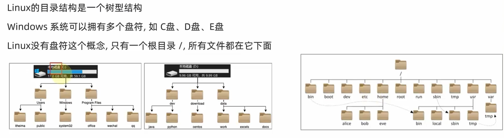

## 一. Linux文件与目录结构

### 1. 一切皆文件

Linux只有一个根目录`/`，



Linux下一切皆文件，即使是windows系统下的文件夹，我们也看作是文件，只不过它叫目录文件，抽象的看，在逻辑上它是树的一个节点，记录了该节点下的文件的位置，信息等。“一切皆是文件”是 Unix/Linux 的基本哲学之一


首先，在windows中是文件的东西,它们在linux中也是文件，其次一些在windows中不是文件的东西, 比如进程, 磁盘, 也被抽象成了文件.。你可以使用访问文件的方法访问它们获得信息。甚至一些很离谱的东西，比如管道，也是文件。甚至类似于socket（套接字）这样的东西, 使用的接口跟文件接口也是一致的。

这样做最明显的好处是，开发者仅需要使用一套 API 和开发工具即可调取 Linux 系统中绝大部分的资源。举个简单的例子，Linux 中几乎所有读（读文件，读系统状态，读 socket，读PIPE）的操作都可以用read函数来进行；几乎所有更改（更改文件，更改系统参数，写 socket，写 PIPE）的操作都可以用write函数来进行。

不利之处在于，使用任何硬件设备都必须与根目录下某一目录执行挂载操作，否则无法使用。我们知道，本身Linux具有一个以根目录为树根的文件目录结构，每个设备也同样如此，它们是相互独立的。如果我们想通过Linux上的根目录找到设备文件的目录结构，就必须将这两个文件系统目录合二为一，这就是挂载的真正含义。


___

### 2. Linux目录结构

由于linux是开放源代码，各大公司和团体根据linux的核心代码做各自的操作，编程。这样就造成在根下的目录的不同。这样就造成个人不能使用他人的linux系统的PC。因为你根本不知道一些基本的配置，文件在哪里。。。这就造成了混乱。这就是FHS（Filesystem Hierarchy Standard ）机构诞生的原因。该机构是linux爱好者自发的组成的一个团体，主要是是对linux做一些基本的要求，不至于是操作者换一台主机就成了linux的‘文盲’。

根据FHS(http://www.pathname.com/fhs/)的官方文件指出， 他们的主要目的是希望让使用者可以了解到已安装软件通常放置于那个目录下， 所以他们希望独立的软件开发商、操作系统制作者、以及想要维护系统的用户，都能够遵循FHS的标准。 也就是说，FHS的重点在于规范每个特定的目录下应该要放置什么样子的数据而已。 这样做好处非常多，因为Linux操作系统就能够在既有的面貌下(目录架构不变)发展出开发者想要的独特风格。

#### 2.1. 根目录 (/) 的意义与内容

根目录是整个系统最重要的一个目录，因为不但所有的目录都是由根目录衍生出来的， 同时根目录也与开机/还原/系统修复等动作有关。 由于系统开机时需要特定的开机软件、核心文件、开机所需程序、 函式库等等文件数据，若系统出现错误时，根目录也必须要包含有能够修复文件系统的程序才行。 因为根目录是这么的重要，所以在FHS的要求方面，他希望根目录不要放在非常大的分区， 因为越大的分区内你会放入越多的数据，如此一来根目录所在分区就可能会有较多发生错误的机会。

因此FHS标准建议：根目录(/)所在分区应该越小越好， 且应用程序所安装的软件最好不要与根目录放在同一个分区内，保持根目录越小越好。 如此不但效能较佳，根目录所在的文件系统也较不容易发生问题。说白了，就是根目录和Windows的C盘一个样。

根据以上原因，FHS认为根目录(/)下应该包含如下子目录：

| 目录   | 应放置档案内容                                               |
| ------ | ------------------------------------------------------------ |
| /bin   | 系统有很多放置执行档的目录，但/bin比较特殊。因为/bin放置的是在单人维护模式下还能够被操作的指令。在/bin底下的指令可以被root与一般帐号所使用，主要有：cat,chmod(修改权限), chown, date, mv, mkdir, cp, bash等等常用的指令。 |
| /boot  | 主要放置开机会使用到的档案，包括Linux核心档案以及开机选单与开机所需设定档等等。Linux kernel常用的档名为：vmlinuz ，如果使用的是grub这个开机管理程式，则还会存在/boot/grub/这个目录。 |
| /dev   | 在Linux系统上，任何装置与周边设备都是以档案的型态存在于这个目录当中。 只要通过存取这个目录下的某个档案，就等于存取某个装置。比要重要的档案有/dev/null, /dev/zero, /dev/tty , /dev/lp*, / dev/hd*, /dev/sd*等等 |
| /etc   | 系统主要的设定档几乎都放置在这个目录内，例如人员的帐号密码档、各种服务的启始档等等。 一般来说，这个目录下的各档案属性是可以让一般使用者查阅的，但是只有root有权力修改。 FHS建议不要放置可执行档(binary)在这个目录中。 比较重要的档案有：/etc/inittab, /etc/init.d/, /etc/modprobe.conf, /etc/X11/, /etc/fstab, /etc/sysconfig/等等。 另外，其下重要的目录有：/etc/init.d/ ：所有服务的预设启动script都是放在这里的，例如要启动或者关闭iptables的话： /etc/init.d/iptables start、/etc/init.d/ iptables stop/etc/xinetd.d/ ：这就是所谓的super daemon管理的各项服务的设定档目录。/etc/X11/ ：与X Window有关的各种设定档都在这里，尤其是xorg.conf或XF86Config这两个X Server的设定档。 |
| /home  | 这是系统预设的使用者家目录(home directory)。 在你新增一个一般使用者帐号时，预设的使用者家目录都会规范到这里来。比较重要的是，家目录有两种代号：  ~ ：代表当前使用者的家目录，而 ~guest：则代表用户名为guest的家目录。 |
| /lib   | 系统的函式库非常的多，而/lib放置的则是在开机时会用到的函式库，以及在/bin或/sbin底下的指令会呼叫的函式库而已 。 什么是函式库呢？妳可以将他想成是外挂，某些指令必须要有这些外挂才能够顺利完成程式的执行之意。 尤其重要的是/lib/modules/这个目录，因为该目录会放置核心相关的模组(驱动程式)。 |
| /media | media是媒体的英文，顾名思义，这个/media底下放置的就是可移除的装置。 包括软碟、光碟、DVD等等装置都暂时挂载于此。 常见的档名有：/media/floppy, /media/cdrom等等。 |
| /mnt   | 如果妳想要暂时挂载某些额外的装置，一般建议妳可以放置到这个目录中。在古早时候，这个目录的用途与/media相同啦。 只是有了/media之后，这个目录就用来暂时挂载用了。 |
| /opt   | 这个是给第三方协力软体放置的目录 。 什么是第三方协力软体啊？举例来说，KDE这个桌面管理系统是一个独立的计画，不过他可以安装到Linux系统中，因此KDE的软体就建议放置到此目录下了。 另外，如果你想要自行安装额外的软体(非原本的distribution提供的)，那么也能够将你的软体安装到这里来。 不过，以前的Linux系统中，我们还是习惯放置在/usr/local目录下。 |
| /root  | 系统管理员(root)的家目录。 之所以放在这里，是因为如果进入单人维护模式而仅挂载根目录时，该目录就能够拥有root的家目录，所以我们会希望root的家目录与根目录放置在同一个分区中。 |
| /sbin  | Linux有非常多指令是用来设定系统环境的，这些指令只有root才能够利用来设定系统，其他使用者最多只能用来查询而已。放在/sbin底下的为开机过程中所需要的，里面包括了开机、修复、还原系统所需要的指令。至于某些伺服器软体程式，一般则放置到/usr/sbin/当中。至于本机自行安装的软体所产生的系统执行档(system binary)，则放置到/usr/local/sbin/当中了。常见的指令包括：fdisk, fsck, ifconfig, init, mkfs等等。 |
| /srv   | srv可以视为service的缩写，是一些网路服务启动之后，这些服务所需要取用的资料目录。 常见的服务例如WWW, FTP等等。 举例来说，WWW伺服器需要的网页资料就可以放置在/srv/www/里面。呵呵，看来平时我们编写的代码应该放到这里了。 |
| /tmp   | 这是让一般使用者或者是正在执行的程序暂时放置档案的地方。这个目录是任何人都能够存取的，所以你需要定期的清理一下。当然，重要资料不可放置在此目录啊。 因为FHS甚至建议在开机时，应该要将/tmp下的资料都删除。 |

事实上FHS针对根目录所定义的标准就仅限于上表，不过仍旧有些目录也需要我们了解一下，具体如下：

| 目录        | 应放置文件内容                                               |
| ----------- | ------------------------------------------------------------ |
| /lost+found | 这个目录是使用标准的ext2/ext3档案系统格式才会产生的一个目录，目的在于当档案系统发生错误时，将一些遗失的片段放置到这个目录下。 这个目录通常会在分割槽的最顶层存在，例如你加装一个硬盘于/disk中，那在这个系统下就会自动产生一个这样的目录/disk/lost+found |
| /proc       | 这个目录本身是一个虚拟文件系统(virtual filesystem)喔。 他放置的资料都是在内存当中，例如系统核心、行程资讯(process)（是进程吗?）、周边装置的状态及网络状态等等。因为这个目录下的资料都是在记忆体（内存）当中，所以本身不占任何硬盘空间。比较重要的档案（目录）例如： /proc/cpuinfo, /proc/dma, /proc/interrupts, /proc/ioports, /proc/net/*等等。呵呵，是虚拟内存吗[guest]？ |
| /sys        | 这个目录其实跟/proc非常类似，也是一个虚拟的档案系统，主要也是记录与核心相关的资讯。 包括目前已载入的核心模组与核心侦测到的硬体装置资讯等等。 这个目录同样不占硬盘容量。 |


除了这些目录的内容之外，另外要注意的是，因为根目录与开机有关，开机过程中仅有根目录会被挂载， 其他分区则是在开机完成之后才会持续的进行挂载的行为。就是因为如此，因此根目录下与开机过程有关的目录， 就不能够与根目录放到不同的分区去。那哪些目录不可与根目录分开呢？有底下这些：

/etc：配置文件

/bin：重要执行档

/dev：所需要的装置文件

/lib：执行档所需的函式库与核心所需的模块

/sbin：重要的系统执行文件

这五个目录千万不可与根目录分开在不同的分区。


#### 2.2. /usr 的意义与内容

依据FHS的基本定义，/usr里面放置的数据属于可分享的与不可变动的(shareable, static)， 如果你知道如何透过网络进行分区的挂载(例如在服务器篇会谈到的NFS服务器)，那么/usr确实可以分享给局域网络内的其他主机来使用喔。

/usr不是user的缩写，其实usr是Unix Software Resource的缩写， 也就是Unix操作系统软件资源所放置的目录，而不是用户的数据啦。这点要注意。 FHS建议所有软件开发者，应该将他们的数据合理的分别放置到这个目录下的次目录，而不要自行建立该软件自己独立的目录。

因为是所有系统默认的软件(distribution发布者提供的软件)都会放置到/usr底下，因此这个目录有点类似Windows 系统的C:\Windows\ + C:\Program files\这两个目录的综合体，系统刚安装完毕时，这个目录会占用最多的硬盘容量。 一般来说，/usr的次目录建议有底下这些：

| 目录          | 应放置文件内容                                               |
| ------------- | ------------------------------------------------------------ |
| /usr/X11R6/   | 为X Window System重要数据所放置的目录，之所以取名为X11R6是因为最后的X版本为第11版，且该版的第6次释出之意。 |
| /usr/bin/     | 绝大部分的用户可使用指令都放在这里。请注意到他与/bin的不同之处。(是否与开机过程有关) |
| /usr/include/ | c/c++等程序语言的档头(header)与包含档(include)放置处，当我们以tarball方式 (*.tar.gz 的方式安装软件)安装某些数据时，会使用到里头的许多包含档。 |
| /usr/lib/     | (类似C:\Windows\System32)包含各应用软件的函式库、目标文件(object file)，以及不被一般使用者惯用的执行档或脚本(script)。 某些软件会提供一些特殊的指令来进行服务器的设定，这些指令也不会经常被系统管理员操作， 那就会被摆放到这个目录下啦。要注意的是，如果你使用的是X86_64的Linux系统， 那可能会有/usr/lib64/目录产生 |
| /usr/local/   | (用户级程序目录，类似C:\Program Files)系统管理员在本机自行安装自己下载的软件(非distribution默认提供者)，建议安装到此目录， 这样会比较便于管理。举例来说，你的distribution提供的软件较旧，你想安装较新的软件但又不想移除旧版， 此时你可以将新版软件安装于/usr/local/目录下，可与原先的旧版软件有分别啦。 你可以自行到/usr/local去看看，该目录下也是具有bin, etc, include, lib...的次目录 |
| /usr/sbin/    | 非系统正常运作所需要的系统指令。最常见的就是某些网络服务器软件的服务指令(daemon) |
| /usr/share/   | 放置共享文件的地方，在这个目录下放置的数据几乎是不分硬件架构均可读取的数据， 因为几乎都是文本文件嘛。在此目录下常见的还有这些次目录：/usr/share/man：联机帮助文件/usr/share/doc：软件杂项的文件说明/usr/share/zoneinfo：与时区有关的时区文件 |
| /usr/src/     | 一般原始码建议放置到这里，src有source的意思。至于核心原始码则建议放置到/usr/src/linux/目录下。 |


### 3.Linux文件类型与后缀名

文件在底层都是相同的，都是放置在磁盘上的一长串二进制串，而不同的编码解码，或者说数据的排布格式，决定了文件的“表现形式”，如可执行文件（即程序，二进制或文本脚本），文本文件，图片文件等。

一谈到文件类型，不同于Windows的文件类型，比如file.txt、file.doc、file.sys、file.mp3、file.exe等，根据文件的后缀就能判断文件的类型，即Windows是以文件的表现形式进行分类。但在Linux一个文件是否能被执行，表现为哪种形式，和后缀名没有太大的关系，主要看文件的属性有关。但我们了解一下Linux文件的后缀名还是有必要的，特别是我们自己创建一些文件，最好还是加后缀名，这样做的目的是仅仅是为了我们的在应用时方便。

现在的Linux桌面环境和Windows一样智能化，文件的类型是和相应的程序关联的。在我们打开某个文件时，系统会自动判断用哪个应用程序打开。如果从这方面来说，Linux桌面环境和Windows桌面没有太大的区别。

在Linux中，带有扩展名的文件，只能代表程序的关联，并不能说明文件是可以执行或如何表现，从这方面来说，Linux的扩展名没有太大的意义。

Linux文件类型和Linux文件的文件名所代表的意义是两个不同的概念。我们通过一般应用程序而创建的比如file.txt、file.tar.gz ，这些文件虽然要用不同的程序来打开，但放在Linux文件类型中衡量的话，大多是常规文件（也被称为普通文件）。

Linux文件类型常见的有：普通文件（包括文本文件，二进制可执行文件）、目录、字符设备文件、块设备文件、符号链接文件等，这样分类更像是在反映一种操作系统对硬件进行抽象时产生的不同结果。


## 二. 用户管理与权限

操作系统采用多用户的管理模式进行权限管理

- 在Linux系统中，拥有最大权限的账户为`root`（超级管理员）

- 一般使用电脑者使用自创账户，即普通用户权限

  - 普通用户一般在`home`目录内不受限
  - 离开`home`目录，大多数地方普通用户仅有只读和执行的权限，无修改权限

- 这种模式这是由于早年计算机还未充分个人化，多人使用同一台计算机设备而产生的解决方案

  

**切换账户 : `su` 命令**

```shell
# su : Switch User
su [-] [用户名]
# -符号: 可选，表示是否在切换用户后加载环境变量，建议带上
# 用户名: 可选，表示要切换的用户，若省略表示切换到root（已知root账户密码的情况下）
# 切换用户后，可以使用exit命令退回上一个用户，也可以使用快捷键："ctrl + d"
# 使用普通用户切换到其他用户需要使用密码；使用root用户切换到其他用户，无需密码，直接切换
```


>#### 在Ubuntu中切换用户的方法
>
>在Ubuntu操作系统中，用户可以通过多种方式在不同用户之间切换。这对于需要执行特定权限操作的情况非常有用，例如访问受限文件或执行系统级命令。
>
>**使用命令行切换用户**
>
>在命令行环境中，可以使用*su*（switch user）命令来切换用户。如果你想从当前用户切换到root用户，可以使用以下命令：
>
>```shell
>sudo su
>```
>
>这个命令会将你的用户切换到root用户，这通常需要root权限。**由于Ubuntu默认情况下root用户没有固定密码，因此直接使用*su*命令可能不会成功，因为你不知道root的密码。**
>
>在切换到root用户后，如果想要切回到普通用户，可以使用以下命令：
>
>```shell
>su -l 用户名
>```
>
>或者简单地使用*exit*命令或*Ctrl+D*快捷键退出当前root会话。
>
>**设置root用户密码**
>
>如果你需要为root用户设置一个固定密码，可以执行以下命令：
>
>```shell
>sudo passwd root
>```
>
>
>
>按照提示操作，设置一个新的root密码。设置密码后，你可以直接使用*su root*命令并输入密码来切换到root用户。
>
>**禁用和启用root登录**
>
>如果你想禁用root用户的登录，可以使用以下命令：
>
>```shell
>sudo passwd -l root
>```
>
>
>
>这个命令只是禁用root用户，但密码仍然会被保存。如果你想重新启用root用户的登录，可以执行：
>
>```shell
>sudo passwd -u root
>```
>
>


**授权（相当于windows下以管理员身份运行）: `sudo`命令**

```shell
# 长期使用root用户，可能会在不经意时造成系统损坏，使用sudo命令，为普通的命令授权，临时以root身份运行
sudo 其他命令
# 不是所有用户都有权使用sudo命令获取特权，我们需要为普通用户配置sudo认证
```

>#### 为普通用户配置sudo认证
>
>切换到`root`用户，执行`vim sudo` ，打开vim编辑器在文件的最后添加：
>
>```shell
>用户名 ALL=(ALL)	NOPASSWD:ALL
># 其中NOPASSWD:ALL 表示使用sudo命令时，无需输入密码
>```
>
>`wq`保存并退出
>
>然后切换会普通用户即可执行sudo


---

**e.g.** 对于大多数的类 Unix 系统，有一类用户是非常特殊的，那就是：根用户（root user）。 您应该已经注意到了，在上面的输出结果中，根用户几乎不受任何限制，他可以创建、读取、更新和删除系统中的任何文件。 通常在我们并不会以根用户的身份直接登录系统，因为这样可能会因为某些错误的操作而破坏系统。 取而代之的是我们会在需要的时候使用 `sudo` 命令。顾名思义，它的作用是让您可以以 su（super user 或 root 的简写）的身份执行一些操作。 当您遇到拒绝访问（permission denied）的错误时，通常是因为此时您必须是根用户才能操作。然而，请再次确认您是真的要执行此操作。

有一件事情是您必须作为根用户才能做的，那就是向 `sysfs` 文件写入内容。系统被挂载在 `/sys` 下，`sysfs` 文件则暴露了一些内核（kernel）参数。 因此，您不需要借助任何专用的工具，就可以轻松地在运行期间配置系统内核。**注意 Windows 和 macOS 没有这个文件**.

例如，您笔记本电脑的屏幕亮度写在 `brightness` 文件中，它位于

```bash
/sys/class/backlight
```

通过将数值写入该文件，我们可以改变屏幕的亮度。现在，蹦到您脑袋里的第一个想法可能是：

```bash
$ sudo find -L /sys/class/backlight -maxdepth 2 -name '*brightness*'
/sys/class/backlight/thinkpad_screen/brightness
$ cd /sys/class/backlight/thinkpad_screen
$ sudo echo 3 > brightness
An error occurred while redirecting file 'brightness'
open: Permission denied
```

出乎意料的是，我们还是得到了一个错误信息。毕竟，我们已经使用了 `sudo` 命令！关于 shell，有件事我们必须要知道。`|`、`>`、和 `<` 是通过 shell 执行的，而不是被各个程序单独执行。 `echo` 等程序并不知道 `|` 的存在，它们只知道从自己的输入输出流中进行读写。 回到上面更改屏幕亮度命令执行的报错，为了能让 `sudo echo` 命令输出的亮度值写入 brightness 文件， *shell* (权限为当前用户) 会先尝试打开 brightness 文件，但此时操作 shell 的不是根（root）用户，所以系统拒绝了这个打开操作，提示无权限。

明白这一点后，我们可以这样操作：

```bash
$ echo 3 | sudo tee brightness
```

此时打开 `/sys` 文件的是 `tee` 这个程序，并且该程序以 `root` 权限在运行，因此操作可以进行。 这样您就可以在 `/sys` 中愉快地玩耍了，例如修改系统中各种 LED 的状态（路径可能会有所不同）：

```bash
$ echo 1 | sudo tee /sys/class/leds/input6::scrolllock/brightness
```

---

**用户和用户组：**

Linux系统中可以

- 配置多个用户
- 配置多个用户组
- 一个用户可以加入多个用户组

相应的，LInux中关于权限的管控有两个级别

- 针对用户的权限控制
- 针对用户组的权限控制

比如，针对某文件，可以控制用户对其的权限，也可以控制用户组对其的权限


==以下命令中的创建/删除命令需root用户执行，因此要么切换到root用户，要么使用sudo授权==

### 1. **用户组管理：**

- 创建用户组

```shell
groupadd 用户组名
```

- 删除用户组

```shell
groupdel 用户组名
```

- 查看组信息

```shell
# 组信息保存在/etc/group 文件中，/etc目录是专门用来保存系统配置信息的目录
cat /etc/group
```

>将用户分组是Linux 系统中对用户进行管理及控制访问权限的一种手段。
>
>每个用户都属于某个用户组；一个组中可以有多个用户，一个用户也可以属于不同的组。
>
>当一个用户同时是多个组中的成员时，在/etc/passwd文件中记录的是用户所属的主组，也就是登录时所属的默认组，而其他组称为附加组。
>
>用户组的所有信息都存放在/etc/group文件中，由冒号(:)隔开若干个字段，这些字段有：
>
>```
>组名:口令:组标识号:组内用户列表
>```
>
>1. "组名" 是用户组的名称，由字母或数字构成。组名不应重复。
>2. "密码" 字段存放的是用户组加密后的密码。一般Linux 系统的用户组都没有密码，即这个字段一般为空，或者是*。
>3. "组标识号（GID）" 与用户标识号类似，也是一个整数，被系统内部用来标识组。
>4. "组内用户列表" 是属于这个组的所有用户的列表，不同用户之间用逗号(,)分隔。这个用户组可能是用户的主组，也可能是附加组。

- 修改用户组的属性

```shell
groupmod 选项 用户组
# 常用的选项有：
# -g GID :为用户组指定新的组标识号。
# n新用户组 :将用户组的名字改为新名字
```


### 2. **用户管理：**

- 创建用户 & 设置/修改密码

```shell
useradd [-g -d] 用户名
# -g: 指定用户所属的组，指定-g需要组已经存在，如果已存在与用户名同名的组，则必须使用-g; 不指定-g则会创建与用户名同名的组并自动加入
# -d: 指定用户的home路径，不指定，home目录默认在：/home/用户名
passwd 用户名
# 普通用户可直接用passwd修改自己的账户密码
```

- 删除用户

```shell
userdel [-r] 用户名
# -r: 删除用户的home目录; 不使用-r，删除用户时会将home目录保留
```

- 查看用户信息

```shell
# 用户信息保存在/etc/passwd 文件中
cat /etc/passwd | grep 用户名
或
getent passwd   #等价于 cat /etc/passwd

# 只想查看用户所属组
id [用户名]
# 用户名: 若不提供，则查看自身

who
# 查看当前所有登录操作系统的用户列表
whoami
# 查看当前登录用户的用户名
```

>passwd文件由6个冒号组成7个字段，
>
>```shell
>用户名:口令:用户标识号:主组标识号:注释性描述:主目录:登录Shell
>```
>
>具体含义如下：
>
>1. “用户名”
>2. “密码”一般为x，表示加密的密码
>3. “用户标识号（UID）” 一个整数，系统内部用它来标识用户
>4. “主组标识号（GID）”
>5. “注释性描述” 字段记录着用户的一些个人情况
>6. “主目录” home目录位置
>7. “登录shell” 用户登录后，要启动一个进程，负责将用户的操作传给内核，这个进程是用户登录到系统后运行的命令解释器或某个特定的程序，即Shell。注意：用户的登录Shell也可以指定为某个特定的程序（此程序不是一个命令解释器），利用这一特点，我们可以限制用户只能运行指定的应用程序，在该应用程序运行结束后，用户就自动退出了系统。有些Linux 系统要求只有那些在系统中登记了的程序才能出现在这个字段中。
>
>>**系统中有一类用户称为伪用户（pseudo users）**
>>
>>这些用户在/etc/passwd文件中也占有一条记录，但是不能登录，因为它们的登录Shell为空。它们的存在主要是方便系统管理，满足相应的系统进程对文件属主的要求。
>>
>>常见的伪用户如下所示：
>
>>```shell
>>伪 用 户 含 义 
>>bin 拥有可执行的用户命令文件 
>>sys 拥有系统文件 
>>adm 拥有帐户文件 
>>uucp UUCP使用 
>>lp lp或lpd子系统使用 
>>nobody NFS使用
>>```


- 修改用户账号的属性

`usermod` 命令可以用来设置用户的 主组/附加组 和 登录shell，

- 主组：通常在新建用户时指定，在`/etc/passwd`中GID对应的组即为主组
- 附加组：在`/etc/group`中最后一列表示该组是这一列中用户的附加组，或`id`命令后得到的`组=`中的非GID组即为该用户的附加组，用于指定用户的附加权限

```shell
# 修改用户的主组
usermod -g 用户组名 用户名
# 修改用户的附加组
usermod -G 用户组名 用户名
# 修改用户的登录shell
usermod -s /bin/bash
# 修改用户账号名称
usermod -l 新用户名 原用户名
# 修改用户uid
usermod -u <uid> 原用户名
# 解除密码绑定
usermod -U 用户名
```

>默认使用`useradd`添加的用户没有权限使用sudo获取特权，这里我们除了在root用户下修改文件，还可以用另一种方法，即将用户添加到sudo附加组中
>
>```shell
>usermod -G sudo 用户名
>```

- 技巧：添加批量用户

添加和删除用户对每位Linux系统管理员都是轻而易举的事，比较棘手的是如果要添加几十个、上百个甚至上千个用户时，我们不太可能还使用useradd一个一个地添加，必然要找一种简便的创建大量用户的方法。Linux系统提供了创建大量用户的工具，可以让您立即创建大量用户，方法如下：

#### （1）先编辑一个文本用户文件。

每一列按照`/etc/passwd`密码文件的格式书写，要注意每个用户的用户名、UID、宿主目录都不可以相同，其中密码栏可以留做空白或输入x号。一个范例文件user.txt内容如下：

```
user001::600:100:user:/home/user001:/bin/bash
user002::601:100:user:/home/user002:/bin/bash
user003::602:100:user:/home/user003:/bin/bash
user004::603:100:user:/home/user004:/bin/bash
user005::604:100:user:/home/user005:/bin/bash
user006::605:100:user:/home/user006:/bin/bash
```

#### （2）以root身份执行命令 `/usr/sbin/newusers`，从刚创建的用户文件`user.txt`中导入数据，创建用户：

```
# newusers < user.txt
```

然后可以执行命令 `vipw` 或 `vi /etc/passwd` 检查 `/etc/passwd` 文件是否已经出现这些用户的数据，并且用户的宿主目录是否已经创建。

#### （3）执行命令/usr/sbin/pwunconv。

将 `/etc/shadow` 产生的 `shadow` 密码解码，然后回写到 `/etc/passwd` 中，并将`/etc/shadow`的`shadow`密码栏删掉。这是为了方便下一步的密码转换工作，即先取消 `shadow password` 功能。

```
# pwunconv
```

#### （4）编辑每个用户的密码对照文件。

格式为：

```
用户名:密码
```

实例文件 `passwd.txt` 内容如下：

```
user001:123456
user002:123456
user003:123456
user004:123456
user005:123456
user006:123456
```

#### （5）以 root 身份执行命令 `/usr/sbin/chpasswd`。

创建用户密码，`chpasswd` 会将经过 `/usr/bin/passwd` 命令编码过的密码写入 `/etc/passwd` 的密码栏。

```
# chpasswd < passwd.txt
```

#### （6）确定密码经编码写入/etc/passwd的密码栏后。

执行命令 `/usr/sbin/pwconv` 将密码编码为 `shadow password`，并将结果写入 `/etc/shadow`。

```
# pwconv
```

这样就完成了大量用户的创建了，之后您可以到/home下检查这些用户宿主目录的权限设置是否都正确，并登录验证用户密码是否正确。

### 3. **查看和管理用户权限控制：**

为了保护系统的安全性，Linux 系统对不同的用户访问同一文件（包括目录文件）的权限做了不同的规定。

在 Linux 中我们可以使用 **ll** 或者 **ls –l** 命令来显示一个文件的属性以及文件所属的用户和组，如：

```shell
[root@www /]# ls -l
total 64
dr-xr-xr-x   2 root root 4096 Dec 14  2012 bin
dr-xr-xr-x   4 mysql mysql 4096 Apr 19  2012 boot
……
```

实例中，**bin** 文件的第一个属性用 **d** 表示。**d** 在 Linux 中代表该文件是一个目录文件。

在 Linux 中第一个字符代表这个文件是目录、文件或链接文件等等。

- 当为 **d** 则是目录
- 当为 **-** 则是文件；
- 若是 **l** 则表示为链接文档(link file)；
- 若是 **b** 则表示为装置文件里面的可供储存的接口设备(可随机存取装置)；
- 若是 **c** 则表示为装置文件里面的串行端口设备，例如键盘、鼠标(一次性读取装置)。


---

接下来的字符中，以三个为一组，且均为 **rwx** 的三个参数的组合。其中， **r** 代表可读(read)、 **w** 代表可写(write)、 **x** 代表可作为程序执行(execute)。 要注意的是，这三个权限的位置不会改变，如果没有权限，就会出现减号 **-** 而已。


从左至右用 **0-9** 这些数字来表示。

第 **0** 位确定文件类型，第 **1-3** 位确定属主（该文件的所有者）拥有该文件的权限。

第4-6位确定属组（所有者的同组用户）拥有该文件的权限，第7-9位确定其他用户拥有该文件的权限。

其中，第 **1、4、7** 位表示读权限，如果用 **r** 字符表示，则有读权限，如果用 **-** 字符表示，则没有读权限；

第 **2、5、8** 位表示写权限，如果用 **w** 字符表示，则有写权限，如果用 **-** 字符表示没有写权限；第 **3、6、9** 位表示可执行权限，如果用 **x** 字符表示，则有执行权限，如果用 **-** 字符表示，则没有执行权限。

>针对目录文件（文件夹）
>
>- r：可以查看文件夹内容，如ls命令
>
>- w：可以在文件夹内创建、删除、改名等
>
>- x：可以更改工作目录到此文件夹，如cd命令


---

对于文件来说，它都有一个特定的所有者，也就是对该文件具有所有权的用户。

同时，在Linux系统中，用户是按组分类的，一个用户属于一个或多个组。

文件所有者以外的用户又可以分为文件所属主组的同组用户和其他用户。

因此，Linux系统按文件所有者（属主）、文件所有者同组用户（属组）和其他用户来规定了不同的文件访问权限。

在以上实例中，mysql 文件是一个目录文件，属主和属组都为 mysql，属主有可读、可写、可执行的权限；与属主同组的其他用户有可读和可执行的权限；其他用户也有可读和可执行的权限。

对于 root 用户来说，一般情况下，文件的权限对其不起作用。


---

#### 4. **更改文件属性：**

**chgrp命令：更改文件属组**

```shell
chgrp [-R] 属组名 文件名
# -R：递归更改文件属组，就是在更改某个目录文件的属组时，如果加上 -R 的参数，那么该目录下的所有文件的属组都会更改。
```


**chown命令：更改文件所有者（owner），也可以同时更改文件所属组**

```shell
chown [–R] 所有者 文件名
chown [-R] 所有者:属组名 文件名
# -R: 递归更改文件所有者，就是在更改某个目录文件的所有者时，如果加上 -R 的参数，那么该目录下的所有文件的所有者都会更改。
```


**chmod：更改文件9个属性**

Linux 文件的基本权限就有九个，分别是 **owner/group/others(拥有者/组/其他)** 三种身份各有自己的 **read/write/execute** 权限。

先复习一下刚刚上面提到的数据：文件的权限字符为： **-rwxrwxrwx** ， 这九个权限是三个三个一组的！其中，我们可以使用数字来代表各个权限，各权限的分数对照表如下：

- r:4
- w:2
- x:1

每种身份(owner/group/others)各自的三个权限(r/w/x)分数是需要累加的，例如要设置权限为： **-rwxrwx---** 分数则是：

- owner = rwx = 4+2+1 = 7
- group = rwx = 4+2+1 = 7
- others= --- = 0+0+0 = 0

所以等一下我们设定权限的变更时，该文件的权限数字就是 **770**。变更权限的指令 chmod 的语法是这样的：

```shell
 chmod [-R] xyz 文件或目录
 # xyz : 就是刚刚提到的数字类型的权限属性，为 rwx 属性数值的相加。
 # -R : 进行递归(recursive)的持续变更，以及连同次目录下的所有文件都会变更
```

 **符号类型改变文件权限**

还有一个改变权限的方法，从之前的介绍中我们可以发现，基本上就九个权限分别是：

- user：用户
- group：组
- others：其他

那么我们就可以使用 **u, g, o** 来代表三种身份的权限。

此外， **a** 则代表 **all**，即全部的身份（默认，不加时默认是**a**）。读写的权限可以写成 **r, w, x**，也就是可以使用下表的方式来看：

| chmod | u g o a | +(加入) -(除去) =(设定) | r w x | 文件或目录 |
| ----- | ------- | ----------------------- | ----- | ---------- |

如果我们需要将文件权限设置为 **-rwxr-xr--** ，可以使用 **chmod u=rwx,g=rx,o=r 文件名** 来设定:

```bash
#  touch test1    // 创建 test1 文件
# ls -al test1    // 查看 test1 默认权限
-rw-r--r-- 1 root root 0 Nov 15 10:32 test1
# chmod u=rwx,g=rx,o=r  test1    // 修改 test1 权限
# ls -al test1
-rwxr-xr-- 1 root root 0 Nov 15 10:32 test1
```

而如果是要将权限去掉而不改变其他已存在的权限呢？例如要拿掉全部人的可执行权限，则：

```bash
#  chmod  a-x test1
# ls -al test1
-rw-r--r-- 1 root root 0 Nov 15 10:32 test1
```


