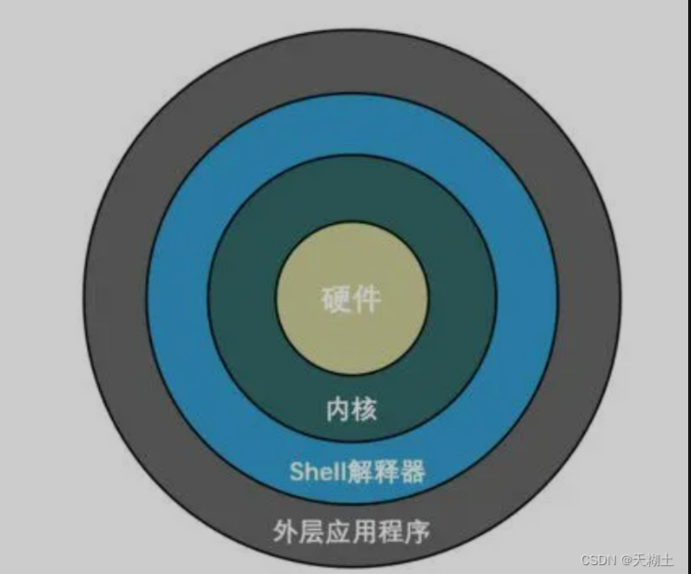
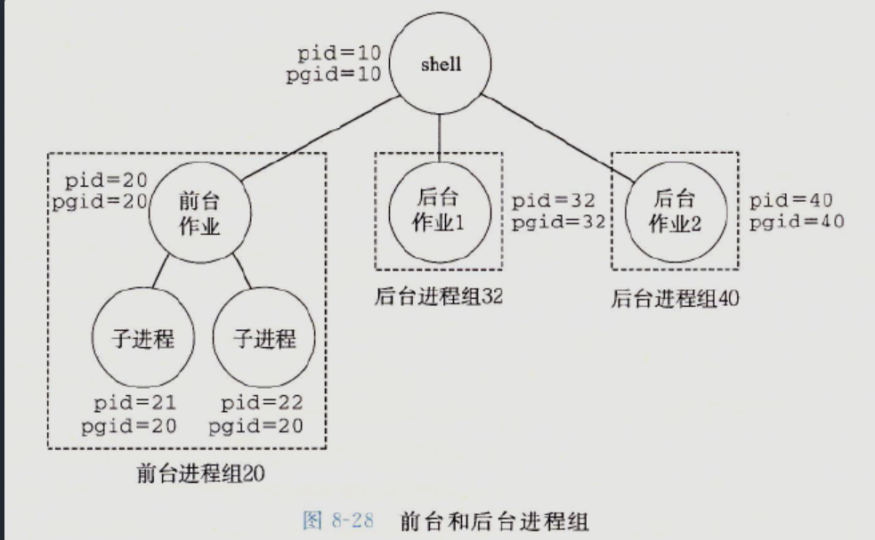

# Linux命令与Shell工具

### 1. Shell与命令行

如今的计算机有着多种多样的交互接口让我们可以进行指令的的输入，从炫酷的图像用户界面（GUI），语音输入甚至是 AR/VR 都已经无处不在。 这些交互接口可以覆盖 80% 的使用场景，但是它们也从根本上限制了您的操作方式——你不能点击一个不存在的按钮或者是用语音输入一个还没有被录入的指令。 为了充分利用计算机的能力，我们不得不回到最根本的方式，使用文字接口：命令行Shell

命令行：命令提示符页面，只能处理字符串(文本)，以纯“字符串”的形式操作系统，用各种字符化的命令对系统发出操作指令，其本身也是一个程序。

shell：shell的意思是“壳”，这个翻译十分生动形象。计算机系统中，真正能够控制计算机硬件（CPU、内存、显示器等）的只有操作系统内核（Kernel），图形界面或命令行只是架设在用户和内核之间的一座桥梁。由于安全、复杂、繁琐等原因，用户不能直接接触内核，而用户使用这个命令行解释器程序，**该程序的作用就是接收用户的操作，并进行简单的处理，同时把一些请求传递给内核**。如此一来，用户和内核之间就多了一层“壳”，这层“壳”既简化了用户的操作，也保护了内核。Linux下这个命令行解释器程序就叫做shell，它连接了用户和 Linux 内核，让用户能够更加高效、安全、低成本地使用、访问 Linux 内核。（当然根据这个定义，我们Windwos图形化界面也是一种Shell程序 —— 图形化Shell）

 Bash（GNU Bourne-Again Shell）是一个为 GNU 计划编写的 Unix shell，Bash 是大多数 Linux 系统的缺省 Shell。




---

**一些名词的区分**

#### 1. Shell

- **是什么？** Shell 是一个**程序**，它是命令行**解释器**，接收你输入的命令，解释并执行它们，然后输出结果。它是用户和操作系统内核（Kernel）之间的“外壳”（所以叫 Shell）。当下它可以分为命令行Shell和图形化Shell。
- **核心功能：** 命令解释、执行脚本、管理进程、进行输入输出重定向等。
- **常见例子：**
  - `Bash` (Bourne-Again Shell): Linux 和 macOS 上最流行的 Shell。
  - `Zsh`: 另一个功能强大的 Shell，现在是 macOS 的默认 Shell。
  - `PowerShell`: Windows 上强大的现代 Shell，不仅处理文本，还处理对象。
  - `Command Prompt` (cmd.exe): Windows 上的传统命令 Shell。

**简单说：Shell 是一个类似于python的解释器，它是真正干活的那个“大脑”。**

#### 2. 命令行 (Command Line)

- **是什么？** 命令行是一个**文本式的交互界面**，你通过在其中输入文本命令来与计算机交互。它是一种**工作方式**或**环境**。
- **核心功能：** 提供一种输入命令的机制。
- **关键点：** “命令行”这个词强调的是**基于文本输入**的这种模式。你是在“一行”文字中键入命令。

**简单说：命令行是一种与Shell的交互接口，以输入命令的方式表现（相对于GUI图形界面点击的方式）。**

#### 3. 终端 (Terminal)

- **是什么？** 终端是一个**程序**，它提供了一个窗口，让你可以在其中与 Shell 进行交互。它**模拟**了过去的硬件终端设备。
- **历史背景：** 在早期，终端（Terminal）是一个物理硬件设备（一台显示器和键盘），通过串口线连接到大型机或小型机上。现在，我们用的都是“终端模拟器”（Terminal Emulator），即在图形界面中模拟那个硬件设备功能的软件。
- **核心功能：** 接收你的键盘输入，并将其发送给 Shell；接收 Shell 的输出，并将其显示在屏幕上。
- **常见例子：**
  - macOS: **Terminal**（终端）， **iTerm2**
  - Linux: **GNOME Terminal**, **Konsole**
  - Windows: **Windows Terminal**, **ConEmu**（Windows 本身的命令提示符和 PowerShell 窗口也可以看作简单的终端）

**简单说：终端是那个你打开的黑窗口或白窗口程序，它是 Shell 的“展示窗口”和“传话员”。**

#### 4. 控制台 (Console)

- **是什么？** 控制台是一个**特殊的终端**，它直接连接到计算机硬件上。终端是通过串口连接上的，不是计算机本身就有的设备，而控制台是 计算机本身就有的设备，一个计算机只有一个控制台。计算机启动的时候，所有的信息都会显示到控制台上，而不会显示到终端上。也就是说，控制台是计算机的基本设备，而终端是附加设备。 当然，由于控制台也有终端一样的功能，控制台有时候也被模糊的统称为终端。 计算机操作系统中，与终端不相关的信息，比如内核消息，后台服务消息，都可以显示到控制台上，但不会显示到终端上。
- **历史背景：** 在过去，控制台（Console）指的是计算机本身的那一套专用物理设备（键盘和显示器），用于直接与操作系统进行底层通信和系统维护。它比通过串口连接的普通终端（Terminal）权限更高、更根本。
- **现代用法：**
  1. **系统控制台：** 在 Linux 系统中，你按 `Ctrl + Alt + F1~F6` 会切换到纯文本的“虚拟控制台”，这才是现代意义上的 Console，它不依赖于图形界面。
  2. **混用：** 在日常口语中，Console 经常和 Terminal 混用，指代同一个黑色窗口。但严格来说，终端模拟器模拟的是 Terminal，而不是 Console。
  3. **开发领域：** 在编程中，“控制台输出”通常指代 `stdout`（标准输出），比如在 C++ 中的 `cout`，Python 中的 `print()`，JavaScript 中的 `console.log()`，它们输出的目的地就是终端/控制台。

**简单说：控制台是那个最原始、最底层的“终端”，现在多用于指系统维护界面或与 Terminal 混用。**


**它们是如何协同工作的？**

1. 你打开一个**终端**（Terminal）程序（比如 iTerm2）。
2. 这个终端程序会启动一个 **Shell**（比如 Zsh），并与之连接。
3. 现在，你可以在终端的窗口里，使用**命令行**（输入文本命令）的方式与 Shell 交互。
4. Shell 解释并执行你的命令，将结果返回给终端程序。
5. 终端程序将这些结果显示在窗口上给你看。
6. 如果在系统启动出问题时，你可能会切换到**控制台**（Console）来进行修复。

**简单来说：你在【终端】里，通过【命令行】输入命令，与【Shell】交互。而【控制台】是一个历史悠久且有时会混用的词。**


---


**命令：即执行Linux程序**

>Linux命令解释程序的工作流程如下：
>
>1. 用户输入命令：用户在终端窗口中输入需要执行的命令，例如”ls”，shell读取当前的命令行(fgets)
>
>2. Shell解析（eval）命令：用户输入的命令首先被Shell解析。Shell是一种命令行解释器程序，负责解析并执行用户输入的命令。通过词法分析，它会将命令分解成命令名和参数，以及执行命令所需的其他信息，构造命令行参数列表argv[] 和环境变量envp[]。
>
>3. 执行命令并加载程序：检查第一个命令行参数，如果命令是一个内置命令（builtin_command），Shell则直接执行该命令；否则Shell根据用户输入的命令名，在系统中找到对应的可执行程序。如果找到了对应的程序，Shell会使用fork函数创建一个子进程，子进程与父进程Shell的地址空间完全相同但独立，之后shell创建新的作业job，并将子进程加入此作业。子进程通过execve系统调用启动加载器，在当前进程的上下文中加载程序，建立文件与进程私有虚拟地址空间的映射，设置PC指向代码区域的入口点_start（创建进程 -> 初始化虚拟内存 -> 跳转到main()例程 ）。
>
>  注：Unix shell 使用job这个抽象概念表示为对一条命令行求值而创建的进程，然后为每个作业创建一个进程组，来管理一条命令中涉及创建多个进程的情况。比如 ls | sort，Shell先创建一个job子进程，然后发现执行此命令需要两个进程：一个运行ls程序，一个运行sort程序；因此，Shell又为该作业创建了两个子进程，它们组成了一个进程组。
>
>  
>
>4. 程序执行：操作系统的进程调度到子进程，子进程获得了命令的控制权后，执行_start处指令。程序开始执行，并根据命令的功能进行相关操作。程序利用虚拟内存机制访存，在第一次执行指令或访问数据时，会产生缺页中断，实现虚拟内存到物理内存的映射（拷贝），然后重新执行指令。执行过程中，程序可能会读取文件、修改系统状态、向终端输出信息等；同时，shell进程还会根据命令是否为后台作业（命令末尾有无`&`），决定是 waitpid() 等待子进程结束，还是立即返回提示符。
>
>5. 程序结束：当程序正常执行完毕或遇到错误时，会返回执行结果或错误信息（正常：发送SIGCHLD信号，错误：发送其他错误信号）。Shell会接收到程序的返回值，并将其显示给用户。父进程Shell的SIGCHLD信号处理子程序，通过waitpid完成对僵死子进程的回收,并删除作业job；若发送其他信号，Shell也会执行对应的信号处理程序。
>
>6. Shell等待下一条命令：父进程shell的waitfg检查job状态非前台，则结束对此进程和作业的处理。Shell会等待用户输入下一条命令，循环执行上述步骤。
>
>总结来说，Linux命令解释程序的工作流程包括用户输入命令、Shell解释命令、执行命令并加载程序、程序执行以及Shell等待下一条命令。通过这个流程，用户可以通过命令行界面与系统交互，并完成各种操作。

==通用格式：==

`command [-options] [parameter]`

- command：命令本身

- -options：[可选]命令的一些选项/标识符，可以通过选项控制命令的行为细节或指定特定的操作

  `-` 单横线选项后面跟的参数必须是单字符参数，一个字符表示一个参数，可以多个参数写在同一个横线后面

  `--` 双横线选项后面跟的参数必须是多字符参数（单词），双横线后只能跟一个参数。

  e.g. `-f`一般表示强制，`-r`一般表示递归的处理文件夹

- parame：[可选]命令的参数，多数用于命令的指向目标（若跟在选项后面，视为该选项的参数）等。

  在需要加参数且为多个参数的时候，参数可以使用“=”分隔，也可以使用空格分隔。

==使用终端的常用技巧及快捷键：==

**放大终端窗口字体**：`ctrl + shift + =`<br>**缩小终端窗口字体**：`ctrl + -`

**查阅命令帮助信息**：	两个选项

```shell
command --help
#显示command命令的帮助信息
man command
#查阅command命令的使用手册manual
```

使用`man`（手册形式展示文件内容）时的操作键：

| 空格键 | 显示手册页的下一页                   |
| :----- | :----------------------------------- |
| Enter  | 一次滚动手册页的一行                 |
| 空格键 | 一次滚动手册页的一页                 |
| b      | 回滚一屏                             |
| f      | 前滚一屏                             |
| q      | 退出                                 |
| /word  | 向下搜索"word"字符串                 |
| ?word  | 向上搜索"word"字符串                 |
| n      | 重复前一个搜索（与 / 或 ? 有关）     |
| N      | 反向重复前一个搜索（与 / 或 ? 有关） |
| :help  | 获取帮助                             |

输入clear或使用快捷键`ctrl + L` ，可以实现**清屏**

直接输入文件的名字作为命令，若该文件是可执行程序，相当于直接**执行该程序**

**强制终止程序运行**：`ctrl + C`

**退出账户当前登录的shell或退出某些特定程序的专属界面**：`ctrl + d`或使用命令`logout`

**自动补全**：在敲出命令的前几个字母后，按下`Tab` 键

- 如果输入的没有歧义，终端会自动补全
- 如果有歧义，再按一下`Tab` ，终端会打印出可能存在的命令

**追溯曾经使用过的命令**：

- 按`上（ctrl + P） / 下（ctrl + N）`光标键可以在曾经使用过的命令之间进行切换

- 若要退出选择并且不想执行当前选中的命令，按`ctrl + C`

- `history`命令查看历史输入过的命令

  有时我们想修改`shell history`的行为，例如，如果在命令的开头加上一个空格，它就不会被加进 shell 记录中。当你输入包含密码或是其他敏感信息的命令时会用到这一特性。为此需要在 `.bashrc` 中添加 `HISTCONTROL=ignorespace` 或者向 `.zshrc` 添加 `setopt HIST_IGNORE_SPACE`。 如果不小心忘了在前面加空格，可以通过编辑 `.bash_history` 或 `.zhistory` 来手动地从历史记录中移除那一项

**分多行输入命令**:

正常来说，命令是以“行”为单位的，因此Shell每次处理一行命令，但如果命令过长，我们希望人为地分多行书写一个命令，通常有几种方式：

1. 使用反斜杠 `\`

   在行尾加一个 `\`，告诉 shell 当前命令还没结束，下一行继续：

   ```bash
   echo this is a very long \
   command that I split \
   into multiple lines
   ```

2. 如果命令中有未闭合的引号或括号，或Shell知晓的未写完的命令，shell 会自动等待下一行补全：

   ```bash
   echo "this is a
   multi-line string"
   
   for i in 1 2 3; do
     echo $i
   done
   ```

Shell 在决定“是否执行命令”时，有个判断逻辑：

- 如果命令完整（语法闭合，行尾没有 `\`），按 **Enter** 就会执行。
- 如果命令不完整（比如引号未闭合、行尾有 `\`、`do...done` 未结束），shell 会换一行，提示符也会变化（通常变成 `>`），等待继续输入。

**光标移动快捷键**：

- `ctrl + a`：跳到命令开头
- `ctrl + e`：跳到命令结尾
- `ctrl + 键盘左键`：向左跳一个单词
- `ctrl + 键盘右键`：向右跳一个单词

**文件路径表示相关**：

​        绝对路径：以根目录为起点，路径描述以`/`开头

​	相对路径：以当前目录为起点，路径描述无需以`/`开头

​	特殊路径符：

- .  表示当前目录
- ..  表示上一级目录
- ~  表示用户的home目录

**可以这样理解，对于操作系统或终端来说，linux每个文件的名字就是其路径，文件名=文件路径；只是对我们人来说，我们起名或说一个文件的名字时，常忽略前面的路径，只说文件自身的名字，也可以知道文件的位置、路径，但终端并不能仅通过名字就知道文件位置**

直接输入文件的路径作为命令，若该文件是可执行程序，相当于直接**执行该程序**；

But，如果直接输入可执行程序的名字，Shell并不一定能找到这个程序文件的位置！

**Recall：Shell根据用户输入的命令名，在系统中找到对应的可执行程序？ --Shell如何查找程序？**

如果第一个命令行参数只给出程序名，或者说是给出相对路径，而不是明确的路径，则会经历下面的查找过程：

1. **alias中查找**

   alias命令可用来设置命令别名，而单独输入alias可以查看到已设置的别名：

   ```bash
   $ alias
   alias egrep='egrep --color=auto'
   alias fgrep='fgrep --color=auto'
   alias grep='grep --color=auto'
   alias l='ls -CF'
   alias la='ls -A'
   alias ll='ls -alF'
   alias ls='ls --color=auto'
   ```

   如果这里没有找到你执行的命令，那么就会接下去查找。如果找到了，那么就会执行下去。

2. **内置命令中查找**

   不同的shell包含一些不同的内置命令，通常不需要shell到磁盘中去搜索。通过help命令可以看到有哪些内置命令：

   ```bash
   $ help
   ```

   通过type 命令可以查看命令类型：

   ```bash
   $ type echo
   echo is a shell builtin
   ```

   如果是内置命令，则会直接执行，否则继续查找。

3. **PATH中查找**

   以ls为例，在shell输入ls时，首先它会从PATH环境变量中查找，PATH内容是什么呢，我们看看：

   ```bash
   $ echo $PATH
   /usr/local/sbin:/usr/local/bin:/usr/sbin:/usr/bin:/sbin:/bin:/usr/games:/usr/local/games
   ```

   所以它会在这些路径下去寻找ls程序，按照路径找到的第一个ls程序就会被执行。使用whereis也能确定ls的位置：

   ```bash
   $ whereis ls
   ls: /bin/ls /usr/share/man/man1/ls.1.g
   ```

   既然它是在bin目录下，那么我把ls从bin目录下移走是不是就找不到了呢？是的。

   ```bash
   $ mv /bin/ls /temp/ls_bak  #测试完后记得改回来奥
   ```

   现在再来执行ls命令看看：

   ```bash
   $ ls 
   The program 'ls' is currently not installed. You can install it by typing:
   apt install coreutils
   ```

   没错，它会提示你没有安装这个程序或者命令没有找到。

   所以你现在明白为什么你第一次安装jdk或者python的时候要设置环境变量了吧？不设置的话行不行？

   行。这个时候你就需要指定路径了。怎么指定路径？无非就是那么几种，相对路径，绝对路径等等。
   比如：

   ```bash
   $ cd /temp
   $ ./ls_bak
   ```

   或者：

   ```bash
   $ /temp/ls_bak
   ```

   是不是发现和运行自己的普通程序方式没什么差别呢？

   到这里，如果还没有找到你要执行的命令，那么就会报错。

4. **确定解释程序**

   在找到程序之后呢，需要确定解释程序。什么意思呢？
   shell通常可以执行两种程序，一种是二进制程序，一种是脚本程序。

   而一旦发现要执行的程序文件是文本文件，且文本未指定解释程序，那么就会默认当成shell脚本来执行。例如，假设有test.txt内容如下：

   ```shell
   echo -e "hello world"
   ```

   赋予执行权限并执行：

   ```bash
   $ chmod +x test.txt
   $ ./test.txt
   hello world
   ```

   当然了，我们通常会在shell脚本程序的来头带上下面这句：

   ```shell
   #!/bin/bash
   ```

   这是告诉shell，你要用bash程序来解释执行test.txt。作为一位调皮的开发者，如果开头改成下面这样呢？

   ```shell
   #!/usr/bin/python
   ```

   再次执行之后结果如下：

   ```bash
   $ ./test.txt
     File "./test.txt", line 2
       echo -e "hello world"
                           ^
   SyntaxError: invalid syntax
   ```

   是的，它被当成python脚本来执行了，自然就会报错了。

   那么如果是二进制程序呢？就会使用execl族函数去创建一个新的进程来运行新的程序了。

   小结一下前面的内容，就是说，如果是文本程序，且开头没有指定解释程序，则按照shell脚本处理，如果指定了解释程序，则使用解释程序来解释运行；对于二进制程序，则直接创建新的进程即可。

### 2. 文件和目录相关命令

- 查看目录内容

```shell
# ls:list,列出目录的内容
ls [-a -l -h] [文件路径]
# -a:all，列出全部文件
# -l:列表（竖向排列）形式展示内容，并展示更多信息
# -h:使用 -lh，显示文件的大小单位
# 参数默认为当前所在工作目录
```

- 切换工作目录

```shell
# cd: Change Directory,更改当前所在的工作目录
cd [文件路径]
# 参数默认为回到用户的home目录
```

- 查看当前工作目录路径

```shell
# pwd: Print Work Directory
pwd
```

- 创建新的目录(文件夹)

```shell
# mkdir: Make Directory
mkdir [-p] 文件路径
# -p: 表示自动创建不存在的父目录，适用于创建连续多层级的目录
# 参数必填，表示要创建的文件夹的路径，相对或绝对表示方法均可
```

- 创建新的文件

```shell
# touch
touch 文件路径
# 参数必填，表示要创建的文件的路径
```

- 拷贝文件 / 文件夹（目录文件）

```shell
# cp: copy, 复制文件/文件夹
cp [-r] 参数1 参数2
# -r: 可选，用于复制文件夹，表示递归
# 参数1: 文件路径，表示被复制的文件或文件夹
# 参数2: 文件路径，表示要复制去的地方，若为文件夹，则复制到文件夹内或复制并重命名文件夹；若为文件，则复制并重命名文件
```

- 移动文件 / 文件夹（目录文件），为文件 / 文件夹（目录文件）改名

```shell
# mv: move, 移动文件/文件夹，为文件 / 文件夹改名
mv 参数1 参数2
# 参数1: 文件路径，表示被移动的文件或文件夹
# 参数2: 文件路径，表示要移动去的地方，若为文件夹，则移动到文件夹内或移动并重命名文件夹；若为文件，则移动并重命名文件
```


mv 参数设置与运行结果（cp也可参考此表）

| 命令格式                                         | 运行结果                                                     |
| :----------------------------------------------- | :----------------------------------------------------------- |
| `mv source_file(文件) dest_file(文件)`           | 将源文件名 source_file 改为目标文件名 dest_file              |
| `mv source_file(文件) dest_directory(目录)`      | 将文件 source_file 移动到目标目录 dest_directory 中          |
| `mv source_directory(目录) dest_directory(目录)` | 目录名 dest_directory 已存在，将 source_directory 移动到目录名 dest_directory 中；目录名 dest_directory 不存在则 source_directory 改名为目录名 dest_directory |
| `mv source_directory(目录) dest_file(文件)`      | 出错                                                         |


- 删除文件 / 文件夹（目录文件）

```shell
# rm: remove, 删除文件/文件夹
rm [-r -f] 参数
# -r: 可选，用于删除文件夹，表示递归
# -f: 可选，强制删除，不弹出提示（root超级管理员用户）
# 参数: 表示要删除的文件或文件夹的路径
rmdir [-p] dirName
# -p: 当子目录被删除后使它也成为空目录的话，则顺便一并删除
```

删除当前目录下的所有文件及目录，命令行为：

```shell
rm  -rf  * 
```

文件一旦通过rm命令删除，则无法恢复，所以必须格外小心地使用该命令。


- 查找命令对应的程序文件位置

```shell
# Linux命令的本体就是一个个二进制可执行程序，我们可以通过which命令，查找所使用的一系列命令的程序文件存放在哪里
which 要查找的命令
```


- 在指定目录下查找匹配的文件和目录

```shell
# find: 在指定目录下查找特定匹配的文件和目录，它可以使用不同的选项来过滤和限制查找的结果
find [文件路径] [匹配条件] [动作]
# 路径 是要查找的目录路径，可以是一个目录或文件名，也可以是多个路径，多个路径之间用空格分隔，如果未指定路径，则默认为当前目录。
# 匹配条件 是可选参数，用于指定查找的条件，可以是文件名、文件类型、文件大小等等。
# 动作 可选的，用于对匹配到的文件执行操作，比如删除、复制等。
```


匹配条件 中可使用的选项有二三十个之多，以下列出最常用的部份：

- `-name pattern`：按文件名查找，文件名`pattern`支持使用通配符 `*` 和 `?`。

- `-type type`：按文件类型查找，可以是 `f`（普通文件）、`d`（目录）、`l`（符号链接）等。

- `-size [+-]size[cwbkMG]`：按文件大小查找，支持使用 `+` 或 `-` 表示大于或小于指定大小，单位可以是 `c`（字节）、`w`（字数）、`b`（块数）、`k`（KB）、`M`（MB）或 `G`（GB）。

- `-mtime days`：按修改时间查找，支持使用 `+` 或 `-` 表示在指定天数前或后，days 是一个整数表示天数。

- `-user username`：按文件所有者查找。

- `-group groupname`：按文件所属组查找。

  ```bash
  e,g.
  # 查找一个文件，比如 .bashrc, /etc路径下的hosts文件
  $ find .bashrc
  $ find /etc/hosts
  
  # 查找当前目录及子目录后缀为gz的文件
  $ find . -type f -name "*.gz"
  # 查找所有的 html 网页文件
  $ find . -type f -regex ".*html$"
  # 将所有 fasta 文件中序列名字包含node的改成seq
  $ find . -type f -regex ".*fasta$" | xargs sed 's/NODE/Seq/g'
  
  # 查找子目录深度为4层目录的fasta文件
  $ find . -type f -maxdepth 4 -name "*.fasta"
  
  # 查找/var/log路径下权限为755的目录
  $ find /var/log -type d -perm 755
  
  # 按照用户查找用户，在tmp路径下查找属于用户 nginx 的文件
  $ find /tmp -user nginx
  # 用户主home路径下查找属于 root 权限，属性为644的文件
  $ find . -user root -perm 644
  ```

  

### 3. 文件内容读写工具的相关命令

**Linux系统下任何文件的读写是按文本文件进行处理**

- 查看文件内容

```shell
# cat: 连接文件并打印到标准输出设备上，它的主要作用是用于查看和连接文件
cat [-b -n] 文件路径
-b: 对非空输出行编号
-n: 对所有输出行编号

# more: 支持翻页，若文件内容过多可以一页页的展示(手册形式)
more 文件路径

# less: less 与 more 类似，less 可以随意浏览文件，支持翻页和搜索，支持向上翻页和向下翻页
less [-m -N] 文件路径
-m: 显示已阅读的百分比
-N:显示每行的行号
```

---

more与less的区别？

​	①less可以按键盘上下方向键显示上下内容，而more不能通过上下方向键控制显示。

　　②less不必读整个文件，加载速度会比more更快。

　　③less退出后shell不会留下刚显示的内容，而more退出后会在shell上留下刚显示的内容。

　　④阅读到文件结束时，less不会退出，而more会。

　　⑤less可用行号或百分比作为书签浏览文件，而more不行。

　　⑥相比more，less提供更加友好的检索、高亮显示等操作。

---


- 在文件中进行文本搜索，模式查找

```shell
# grep: 通过正则表达式过滤文件行，实现模式查找/文本搜索
grep [-n -i] "正则表达式" 文件路径
# -n: 显示匹配行的行号
# -i: 忽略大小写
# 正则表达式 : ^a(搜索以a开头的行), ke$(搜索以ke结束的行)
# 文件路径: 必填，可使用管道符作为输入

e.g. history | grep find
# 利用管道将history输出结果传递给 grep 进行模式搜索，打印包含 find 子串的命令
```

- 统计文件的行数、单词数量、字节数

```shell
# wc: 统计文件的行数、单词数量、字节数
wc [-c -m -l -w] 文件路径
# -c: 统计bytes的数量
# -m: 统计字符的数量
# -l: 统计行数
# -w: 统计单词数量
# 文件路径: 必填，可使用管道符作为输入
```

- **head命令**: 查看文件的开头部分的内容

```bash
head [-<num> -n <数字>] 文件路径
# -<num>: 具体数字，表示查看开头 num 行，不填则默认10行
# -n <数字>: 效果同直接-num
```

- **tail命令**: 查看文件尾部内容，跟踪文件的最新更改

```shell
tail [-f -<num> -n <数字>] 文件路径
# -f: 表示持续跟踪，即监听功能
# -<num>: 具体数字，表示查看尾部 num 行，不填则默认10行
# -n <数字>: 效果同直接-num
# 文件路径: 必填
```

### 4. 输入输出流相关命令

如何在程序 / 文件间创建“链接” / “渠道”？

在 shell 中，程序有两个主要的“流”：它们的输入流和输出流。 当程序尝试读取信息时，它们会从输入流中进行读取，当程序打印信息时，它们会将信息输出到输出流中。 通常，一个程序的输入输出流都是您的终端。也就是，您的键盘作为输入，显示器作为输出。 但是，我们也可以重定向这些流！

- **管道符 `|`** : 将一个命令的输出通过管道作为另一个命令的输入
- **echo命令**：在命令行输出指定字符串内容

```shell
echo 输出的内容
# 无需选项，只有一个参数，表示要输出的字符串，复杂内容可用" "包围
echo `pwd`
# 将命令用反引号包围，被反引号包围的内容不再作为普通字符串直接输出，而是会先被作为命令执行，再将结果输出到命令行
```

- **重定向符**: 执行命令的结果（如echo命令），若不想默认输出到终端命令行，可使用重定向符号写入文件

  - `>` : 将左侧命令的结果，覆盖写入到符号右侧文件
  - `>>` : 将左侧命令的结果，追加写入到符号右侧文件

  **Note：** 当一行命令启动进程组时，第一步往往是先打开输入输出对应的文件，再进行后续操作。

- **tee命令：**Linux tee命令用于读取标准输入的数据，并将其内容输出成文件。

```bash
# tee指令会从标准输入设备读取数据，将其内容输出到标准输出设备，同时保存成文件
tee [-ai][--help][--version][文件...]
# -a或--append 　附加到既有文件的后面，而非覆盖它．
# -i或--ignore-interrupts 　忽略中断信号。
# --help 　在线帮助。
# --version 　显示版本信息。

e.g. 使用指令"tee"将用户输入的数据同时保存到文件"file1"和"file2"中，输入如下命令：
$ tee file1 file2
以上命令执行后，将提示用户输入需要保存到文件的数据，如下所示：
My Linux                        #提示用户输入数据  
My Linux                        #输出数据，进行输出反馈  
```

- 其他一些符号的作用

```shell
command &
# 在后台执行command
command1 && command2
# && 表示逻辑“与”，前一条命令执行成功时才执行后一条命令；若前一条命令执行失败，后一条命令不执行（短路求值）
command1 || command2
# || 表示逻辑“或”，前一条命令执行成功时，后一条命令不会再执行；若前一条命令执行失败，后一条命令才执行（短路求值）
command1;command2
# ; 表示每个命令从左往右依次执行，每个命令彼此之间没有关联
```


