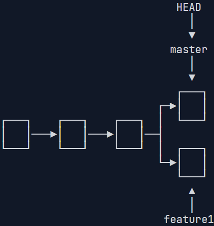
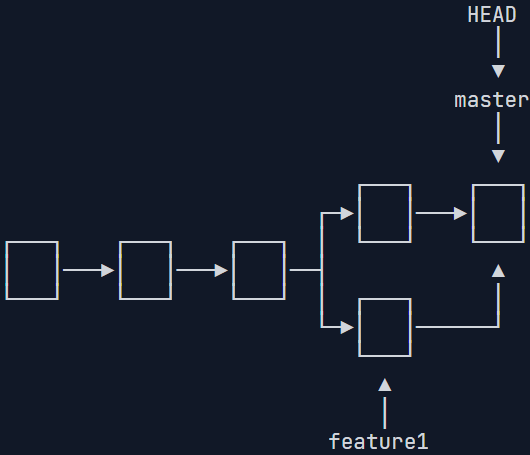
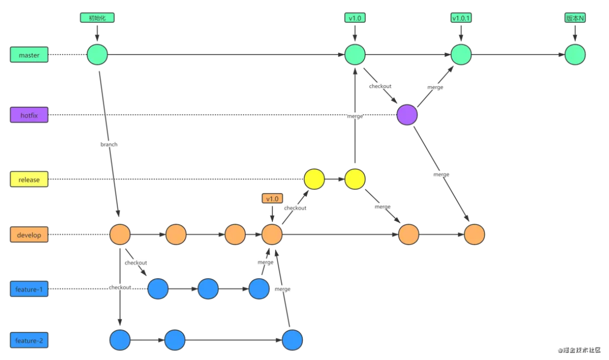

# 版本控制（Git）


---

**Resources：**

[版本控制(Git) · the missing semester of your cs education](https://missing-semester-cn.github.io/2020/version-control/)

[[自制双语字幕\] 计算机教育缺失的一课(2020) - 第6讲 - 版本控制(Git)_哔哩哔哩_bilibili](https://www.bilibili.com/video/BV1Wh4y1s7Lj/?spm_id_from=333.337.search-card.all.click&vd_source=4cf1248054c659cc46bc5bafc9e804af)

[【研1基本功 别人不教的，那就我来】SSH+Git+Gitee+Vscode 学会了就是代码管理大师_哔哩哔哩_bilibili](https://www.bilibili.com/video/BV1Fw4m1C7Tq/?spm_id_from=333.337.search-card.all.click&vd_source=4cf1248054c659cc46bc5bafc9e804af)

https://github.com/git/git/blob/master/Documentation/giteveryday.adoc

[Git](https://git-scm.com/book/zh/v2)

---


版本控制系统 (VCSs) 是一类用于追踪源代码（或其他文件、文件夹）改动的工具。顾名思义，这些工具可以帮助我们管理代码的修改历史；不仅如此，它还可以让协作编码变得更方便。VCS 通过一系列的快照将某个文件夹及其内容保存了起来，每个快照都包含了顶级目录中所有的文件或文件夹的完整状态。同时它还维护了快照创建者的信息以及每个快照的相关信息等等。

为什么说版本控制系统非常有用？即使您只是一个人进行编程工作，它也可以帮您创建项目的快照，记录每个改动的目的、基于多分支并行开发等等。和别人协作开发时，它更是一个无价之宝，您可以看到别人对代码进行的修改，同时解决由于并行开发引起的冲突。

尽管版本控制系统有很多， 其事实上的标准则是 **Git** 。因为 Git 接口的抽象泄漏（leaky abstraction）问题，通过自顶向下的方式（从命令行接口开始）学习 Git 可能会让人感到非常困惑。

尽管 Git 的接口有些丑陋，但是它的底层设计和思想却是非常优雅的。丑陋的接口只能靠死记硬背，而优雅的底层设计则非常容易被人理解。因此，通过一种自底向上的方式学习 Git是很好的。先从数据模型开始，最后再学习它的抽象接口，一旦搞懂了 Git 的数据模型，再学习其接口并理解这些接口是如何操作数据模型的就非常容易了。

## Git的数据模型

Git 拥有一个经过精心设计的模型，这使其能够支持版本控制所需的所有特性，例如维护历史记录、支持分支和促进协作。

空间（文件，文件夹） & 时间（维护历史记录）

### 对文件系统建模：快照Blob

Git 将顶级目录中的文件和文件夹作为集合，并通过一系列快照来管理其历史记录。在 Git 的术语里，文件被称作 Blob 对象（数据对象），也就是一组数据。目录则被称之为“树”，它将名字与 Blob 对象或树对象进行映射（使得目录中可以包含其他目录）。快照则是被追踪的最顶层的树，它可以被看作是带时间戳的文件夹副本。例如，一个树看起来可能是这样的：

```shell
<root> (tree)
|
+- foo (tree)
|  |
|  + bar.txt (blob, contents = "hello world")
|
+- baz.txt (blob, contents = "git is wonderful")
```

这个顶层的树包含了两个元素，一个名为 “foo” 的树（它本身包含了一个 blob 对象 “bar.txt”），以及一个 blob 对象 “baz.txt”。

### 对历史记录建模：关联快照

版本控制系统和快照有什么关系呢？历史记录就是一系列快照，线性历史记录是一种最简单的模型，它包含了一组按照时间顺序线性排列的快照。不过出于种种原因，Git 并没有采用这样的模型。

在 Git 中，历史记录是一个由快照组成的有向无环图，这代表 Git 中的每个快照都有一系列的“父辈”，也就是其之前的一系列快照。注意，快照具有多个“父辈”而非一个，因为某个快照可能由多个父辈而来（因此这是一个图结构而非线性结构）。例如，经过合并后的两条分支。

在 Git 中，这些快照被称为“提交”。通过可视化的方式来表示这些历史提交记录时，看起来差不多是这样的：

```
o <-- o <-- o <-- o
            ^
             \
              --- o <-- o
```

上面是一个 ASCII 码构成的简图，其中的 `o` 表示一次提交（快照）。（继承关系来表现层次）

箭头指向了当前提交的父辈（这是一种“在…之前”，而不是“在…之后”的关系）。在第三次提交之后，历史记录分岔成了两条独立的分支。这可能因为此时需要同时开发两个不同的特性，它们之间是相互独立的。开发完成后，这些分支可能会被合并并创建一个新的提交，这个新的提交会同时包含这些特性。新的提交会创建一个新的历史记录，看上去像这样：

```
o <-- o <-- o <-- o <----  o 
            ^            /
             \          v
              --- o <-- o
```

Git 中的提交是不可改变的。但这并不代表错误不能被修改，只不过这种“修改”实际上是创建了一个全新的提交记录。而引用（参见下文）则被更新为指向这些新的提交。

### 数据模型及其伪代码表示

以伪代码的形式来学习 Git 的数据模型，可能更加清晰：

```c
// 文件就是一组数据
type blob = array<byte>

// 一个包含文件和目录的目录
type tree = map<string, tree | blob>

// 每个提交都包含一个父辈，元数据和顶层树（组合）
type commit = struct {
    parents: array<commit>
    author: string
    message: string
    snapshot: tree
}
```

这是一种简洁的历史模型。

### 对象和内存寻址

Git 中的对象可以是 blob、树或提交：

```c
type object = blob | tree | commit
```

Git 在储存数据时，所有的对象都会基于它们的 [SHA-1 哈希](https://en.wikipedia.org/wiki/SHA-1) 进行寻址。

```python
objects = map<string, object>

def store(object):
    id = sha1(object)
    objects[id] = object

def load(id):
    return objects[id]
```

Blobs、树和提交都一样，它们都是对象。当它们引用其他对象时，它们并没有真正的在硬盘上保存这些对象，而是仅仅保存了它们的哈希值作为引用。

例如，上面例子中的树（可以通过 `git cat-file -p 698281bc680d1995c5f4caaf3359721a5a58d48d` 来进行可视化），看上去是这样的：

```bash
100644 blob 4448adbf7ecd394f42ae135bbeed9676e894af85    baz.txt
040000 tree c68d233a33c5c06e0340e4c224f0afca87c8ce87    foo
```

树本身会包含一些指向其他内容的指针，例如 `baz.txt` (blob) 和 `foo` (树)。如果我们用 `git cat-file -p 4448adbf7ecd394f42ae135bbeed9676e894af85`，即通过哈希值查看 baz.txt 的内容，会得到以下信息：

```bash
git is wonderful
```

### 引用

现在，所有的快照都可以通过它们的 SHA-1 哈希值来标记了。但这也太不方便了，谁也记不住一串 40 位的十六进制字符。

针对这一问题，Git 的解决方法是给这些哈希值赋予人类可读的名字，也就是引用（references）。引用是指向提交的指针。与对象不同的是，它是可变的（引用可以被更新，指向新的提交）。例如，`master` 引用通常会指向主分支的最新一次提交。

```python
references = map<string, string>

def update_reference(name, id):
    references[name] = id

def read_reference(name):
    return references[name]

def load_reference(name_or_id):
    if name_or_id in references:
        return load(references[name_or_id])
    else:
        return load(name_or_id)
```

这样，Git 就可以使用诸如 “master” 这样人类可读的名称来表示历史记录中某个特定的提交，而不需要在使用一长串十六进制字符了。同时，我们将“master”这样的引用视为“分支”的标识。

有一个细节需要我们注意， 通常情况下，我们会想要知道“我们当前所在位置”，并将其标记下来。这样当我们创建新的快照的时候，我们就可以知道它的相对位置（如何设置它的“父辈”）。在 Git 中，我们当前的位置有一个特殊的索引，它就是 “HEAD”。

### 仓库

最后，我们可以粗略地给出 Git 仓库的定义了：`对象` 和 `引用`。

在硬盘上，Git 仅存储对象和引用：因为其数据模型仅包含这些东西。所有的 `git` 命令都对应着对提交树的操作，例如增加对象，增加或删除引用。

当您输入某个指令时，请思考一下这条命令是如何对底层的图数据结构进行操作的。另一方面，如果您希望修改提交树，例如“丢弃未提交的修改和将 ‘master’ 引用指向提交 `5d83f9e` 时，有什么命令可以完成该操作（针对这个具体问题，您可以使用 `git checkout master; git reset --hard 5d83f9e`）

---

抽象：利用组合形成的层次关系如下

文件，文件夹 -> Blob对象，树 -> 快照（顶层树）-不同历史记录下-> commit 

Blob，树（空间），commit（时间）均是对象，对象需要名字索引（哈希）

以上均是**不可变**的；还要提供可变的能力表现状态的迁移（提供引用/指针，破坏引用透明性，但提供了状态迁移的表现）

对象加上它的名字引用就是Git仓库

---

## 暂存区

Git 中还包括一个和数据模型完全不相关的概念，但它确是创建提交的接口的一部分。

就上面介绍的快照系统来说，您也许会期望它的实现里包括一个 “创建快照” 的命令，该命令能够基于当前工作目录的当前状态创建一个全新的快照。有些版本控制系统确实是这样工作的，但 Git 不是。我们希望简洁的快照，而且每次从当前状态创建快照可能效果并不理想。例如，考虑如下场景，您开发了两个独立的特性，然后您希望创建两个独立的提交，其中第一个提交仅包含第一个特性，而第二个提交仅包含第二个特性。或者，假设您在调试代码时添加了很多打印语句，然后您仅仅希望提交和修复 bug 相关的代码而丢弃所有的打印语句。

Git 处理这些场景的方法是使用一种叫做 “暂存区（staging area）”的机制，它在Git工作流中位于工作目录（修改区）和历史记录（提交）之间，允许您指定下次快照中要包括那些改动。

在我们使用Git进行工作时，每次输入的命令，要注意它对我们的**工作目录（修改区）**，**暂存区**和**历史记录（数据模型）**都会造成什么变化，这是记忆和掌握Git的命令行接口的关键。

## Git 的命令行接口

## 基础代码管理

- `git help <command>`: 获取 git 命令的帮助信息

- `git init`: 创建一个新的 git 仓库，其数据会存放在一个名为 `.git` 的目录下

- `git status`: 显示当前的仓库状态

- `git add <filename>`: 添加文件到暂存区

  - `git add .`:添加仓库中所有文件到暂存区

- `git commit`: 创建一个新的提交

  - `git commit -m "<message>"`

  - 如何编写 [良好的提交信息](https://tbaggery.com/2008/04/19/a-note-about-git-commit-messages.html)!
  - 为何要 [编写良好的提交信息](https://chris.beams.io/posts/git-commit/)

- `git log`: 显示历史日志

- `git log --all --graph --decorate`: 可视化历史记录（有向无环图）

- `git show <object>`：指定要显示的 Git 对象。可以是提交哈希、标签、分支名等。

- `git diff <filename>`: 显示HEAD快照与暂存区文件的差异

- `git diff <revision> <revision> <filename>`: 显示某个文件两个版本之间的差异

  `<revision>` 表示提交对应的**哈希字符串**或**引用名**称或**标签名**或**相对引用**，一般命令中默认则为`HAED`

- `git checkout <revision>`: 更新 HEAD 和目前的分支（将HEAD指针转移，指向`<reversion>`提交），并让整个工作目录中的文件和`<revision>`提交完全一致

## 分支和合并

- `git branch`: 显示本地仓库的所有分支（本质上就是引用）
  - `git branch -vv`：显示所有分支的详细信息，包括跟踪的远程分支信息
- `git branch <name>`: 创建分支（本质上就是一个引新的用）
- `git branch -d <name>`:删除分支（本质上是删除一个引用）
  - 在 Git 中，分支只是提交的有向无环图 (DAG) 中提交的指针（引用）。这意味着删除分支只会删除对提交的引用，这可能会使 DAG 中的某些提交无法访问，从而不可见。但是，在已删除分支上的所有提交仍将在存储库中，至少在无法访问的提交被修剪之前（例如使用`git gc`）
  - 如果分支在被删除之前被合并到另一个分支，那么当第一个分支被删除时，所有提交仍然可以从另一个分支访问。它们保持原样；如果分支在没有被合并到另一个分支的情况下被删除，那么该分支中的提交（直到仍然可以访问的提交的分叉点）将不再可见。后者这种情况下使用`git branch -d`将拒绝删除分支，使用 strong的`git branch -D`可强制删除分支.
- `git checkout -b <name>`: 创建分支并切换到该分支
  - 相当于 `git branch <name>; git checkout <name>`
- `git switch <name>`：v2.23版本后专门用于**切换分支**的命令。取代 `git checkout <分支名>`。
  - `git switch -c <新分支名>`：创建并切换分支，取代 `git checkout -b`。
- `git merge <revision>`: 合并到当前分支
- `git mergetool`: 使用工具来处理合并冲突

---

### git并行开发的分支管理

分支合并的类型：

| 类型            | 命令                             | 特点                                                         |
| --------------- | -------------------------------- | ------------------------------------------------------------ |
| Fast-forward    | 默认模式                         | 如果当前分支是目标分支的祖先，则直接移动 HEAD 指针           |
| Recursive       | 默认两路合并                     | 自动合并多个分支的内容，工作原理（Three-way Merge）：Git 会找到两个分支的第一个共同祖先提交（common ancestor），然后对三方（共同祖先、当前分支、要合并的分支）的内容进行合并，并创建一个新的提交来记录这个合并结果，由当前分支指向它。 |
| Octopus         | `git merge branch1 branch2 ...`  | 多分支同时合并                                               |
| No-fast-forward | `git merge --no-ff feature/auth` | 显式强制创建合并提交，保留历史结构（**即使可以进行快进合并，也会强制创建一个合并提交**） |
| Squash压缩合并  | `git merge--squash branch`       | 把 `branch` 的所有提交合并到当前分支，但只产生一个新的合并提交，当前分支的提交历史中不会保留 `branch` 的多次提交记录，即不会记录它和当前分支的合并关系 |


✅ 推荐使用 --no-ff 来保持历史可读性，对于跟踪功能分支的生命周期非常有用，尤其是在主分支合并 feature 分支时。


**（使用 git mergetool） 解决合并两个分支时出现的冲突**

Git 使用三路合并算法（Three-way Merge），基于以下三个版本进行合并：

1. 当前分支（HEAD）
2. 要合并的分支（feature/auth）
3. 公共祖先（Common Ancestor）

因此如果两个分支都修改了同一文件的相同区域，Git 就无法确定保留哪一部分内容，于是标记为冲突。

总结下来，当执行以下操作时可能触发合并冲突：

- `git merge`（合并分支）
- `git pull`（拉取远程代码）
- `git rebase`（变基操作）
- `git cherry-pick`（选择性提交）

此时 Git 会提示 `CONFLICT` 并终止操作，需手动解决冲突。

**一般工作流程：**

1. 配置合并工具（以 KDiff3 为例）

   ```bash
   git config --global merge.tool kdiff3         # 设置默认工具
   git config --global mergetool.kdiff3.path "/usr/bin/kdiff3"  # 指定工具路径
   ```

2. 查看冲突文件

   ```bash
   git status
   # 冲突文件会被标记为 Unmerged paths。
   ```

3. 启动合并工具

   ```bash
   git mergetool
   # 此命令会依次打开所有冲突文件对应的合并工具界面。
   # 或者手动打开冲突文件检查
   ```

4. 标记冲突已解决

   ```bash
   git add <file>  # 将解决后的文件标记为已解决
   
   git commit      
   --or--
   git merge --continue  # 提交合并结果，Git 会自动生成一个合并提交信息，如需修改可手动编辑。
   ```


**主流mergetool（合并工具）及配置：**

1. **Git 内置工具：diff3**

  - 特点：命令行工具，直接展示冲突标记。

  ```bash
  <<<<<<< HEAD
  这是当前分支的代码（例如，在 master 分支上合并 feature 分支，那么这里就是 master 分支的代码）
  =======
  这是要合并进来的分支的代码（例如，feature 分支的代码）
  >>>>>>> branch-name
  ```

  - **使用场景**：适合简单冲突的快速修复。

2. **KDiff3（跨平台）**

   - **安装**：

     - Linux: `sudo apt install kdiff3`
     - macOS: `brew install kdiff3`
     - Windows: 官网下载安装包

   - **配置：**

     ```bash
     git config --global merge.tool kdiff3
     git config --global mergetool.kdiff3.trustExitCode true
     ```

   - **优点**：三窗格对比（本地/远程/基准），可视化操作。

3. **Beyond Compare（商业软件）**

   - 配置

     ```bash
     git config --global merge.tool bc3
     git config --global mergetool.bc3.path "/Applications/Beyond Compare.app/Contents/MacOS/bcomp"
     ```

   - **优点**：强大的文件对比与合并功能，支持文件夹同步。

4. **Visual Studio Code（内置合并工具）**

   - 使用方法：
     1. **打开冲突文件**：VSCode会高亮显示冲突的文件，在VSCode中打开存在冲突的文件，可以看到冲突的代码段，会显示 `Current Changes` 和 `Incoming Changes`。
     2. **解决冲突**：VSCode提供了多个选项帮助解决冲突，例如“Accept Current Change”（接受当前更改）、“Accept Incoming Change”（接受传入更改）、“Accept Both Changes”（接受两者），或者手动编辑冲突部分。
     3. **标记冲突已解决**：解决冲突后，保存文件，并在终端或VSCode的源代码控制面板中提交快照。
   - **优点**：无需额外配置，适合日常开发环境。

**现在，我们从示例开始演示分支管理操作：**

首先，我们创建`dev`分支，然后切换到`dev`分支：

```bash
$ git checkout -b dev
Switched to a new branch 'dev'
```

用`git branch`命令查看当前分支：

```bash
$ git branch
* dev
  master
```

然后，我们就可以在`dev`分支上正常提交，比如对`readme.txt`做个修改，加上一行：

```bash
Creating a new branch is quick.
```

然后提交：

```bash
$ git add readme.txt 
$ git commit -m "branch test"
[dev b17d20e] branch test
 1 file changed, 1 insertion(+)
```

现在，`dev`分支的工作完成，我们就可以切换回`master`分支：

```bash
$ git checkout master
Switched to branch 'master'
```

换回`master`分支后，再查看一个`readme.txt`文件，刚才添加的内容不见了！因为那个提交是在`dev`分支上，而`master`分支此刻的提交点并没有变。

在，我们把`dev`分支的工作成果合并到`master`分支上：

```bash
$ git merge dev
Updating d46f35e..b17d20e
Fast-forward
 readme.txt | 1 +
 1 file changed, 1 insertion(+)
```

注意到上面的`Fast-forward`信息，Git告诉我们，这次合并是“快进模式”，也就是直接把`master`指向`dev`的当前提交，所以合并速度非常快。

合并完成后，就可以放心地删除`dev`分支了：

```bash
$ git branch -d dev
Deleted branch dev (was b17d20e).
```


准备新的`feature1`分支，继续我们的新分支开发：

```bash
$ git switch -c feature1
Switched to a new branch 'feature1'
```

修改`readme.txt`最后一行，改为：

```bash
Creating a new branch is quick AND simple.
```

在`feature1`分支上提交：

```bash
$ git add readme.txt

$ git commit -m "AND simple"
[feature1 14096d0] AND simple
 1 file changed, 1 insertion(+), 1 deletion(-)
```

切换到`master`分支：

```bash
$ git switch master
Switched to branch 'master'
Your branch is ahead of 'origin/master' by 1 commit.
  (use "git push" to publish your local commits)
```

Git还会自动提示我们当前`master`分支比远程的`master`分支要超前1个提交。

在`master`分支上把`readme.txt`文件的最后一行改为：

```bash
Creating a new branch is quick & simple.
```

提交：

```bash
$ git add readme.txt 
$ git commit -m "& simple"
[master 5dc6824] & simple
 1 file changed, 1 insertion(+), 1 deletion(-)
```

现在，`master`分支和`feature1`分支各自都分别有新的提交，变成了这样：



这种情况下，Git无法执行“快速合并”，只能试图把各自的修改合并起来，但这种合并就可能会有冲突，我们试试看：

```bash
$ git merge feature1
Auto-merging readme.txt
CONFLICT (content): Merge conflict in readme.txt
Automatic merge failed; fix conflicts and then commit the result.
```

果然冲突了！Git告诉我们，`readme.txt`文件存在冲突，必须手动解决冲突后再提交。`git status`也可以告诉我们冲突的文件：

```bash
$ git status
On branch master
Your branch is ahead of 'origin/master' by 2 commits.
  (use "git push" to publish your local commits)

You have unmerged paths.
  (fix conflicts and run "git commit")
  (use "git merge --abort" to abort the merge)

Unmerged paths:
  (use "git add <file>..." to mark resolution)

	both modified:   readme.txt

no changes added to commit (use "git add" and/or "git commit -a")
```

我们可以直接查看readme.txt的内容：

```bash
Git is a distributed version control system.
Git is free software distributed under the GPL.
Git has a mutable index called stage.
Git tracks changes of files.
<<<<<<< HEAD
Creating a new branch is quick & simple.
=======
Creating a new branch is quick AND simple.
>>>>>>> feature1
```

Git用`<<<<<<<`，`=======`，`>>>>>>>`标记出不同分支的内容，我们修改如下后保存：

```bash
Git is a distributed version control system.
Git is free software distributed under the GPL.
Git has a mutable index called stage.
Git tracks changes of files.
Creating a new branch is quick and simple.
```

再提交：

```bash
$ git add readme.txt 
$ git commit -m "conflict fixed"
[master cf810e4] conflict fixed
```

现在，`master`分支和`feature1`分支变成了下图所示：



最后，可以正常删除`feature1`分支：

```bash
$ git branch -d feature1
Deleted branch feature1 (was 14096d0).
```


---


## 远端操作

- `git remote`: 列出当前仓库的远端

  - `git remote -v`：列出当前仓库中已配置的远程仓库，并显示它们的 URL。
  - `git remote show <remote_name>`：显示指定远程仓库的详细信息，包括 URL 和跟踪分支。
  - `git remote add <remote_name> <remote_url>`：添加一个新的远程仓库。指定一个远程仓库的名称和 URL，将其添加到当前仓库中。
  - `git remote rename <old_name> <new_name>`：将已配置的远程仓库重命名。
  - `git remote remove <remote_name>`：从当前仓库中删除指定的远程仓库。
  - `git remote set-url <remote_name> <new_url>`：修改指定远程仓库的 URL。

- `git remote add <name> <url>`: 添加一个远端（`<name>`是为远程仓库起的名称，一般叫做`origin`）

- `git push <remote> <local branch>:<remote branch>`: 将对象传送至远端并更新远端引用

  - 该命令会在远程仓库创建一个新分支或更新上面的一个分支
    - 省略`<remote branch>`：本地分支名和远程分支名一样的情况下，可以省略；如果远程主机中不存在该分支，那么会被创建。
  - Git可以用一些方法维护自己本地仓库的分支和远程仓库某分支的关联，这样`git push`就可以简化输入，它会知道当前分支对应的远端分支并自动扩展所有的参数。
    - `git branch --set-upstream-to=<remote/remote branch>` (`<remote/remote branch>`,例如`origin/master`，)：设置当前分支跟踪来自origin的master分支。
    - 最初使用`git push`完整命令时，顺便添加选项`-u`或`--set-upstream`，这会将本地分支与远程分支关联。
    - `git branch --unset-upstream <branch name>`: 解除关联
    - `git branch -vv`: 查看本地分支与远程分支的关联关系

- `git fetch <remote>`: 与远程仓库通信，从远端获取对象/索引但不改变当前本地的对象与引用（若只有一个远程仓库，则`<remote>`默认直接使用它）

- `git pull`: （参数同`git push`）相当于 `git fetch; git merge`

- `git clone <url> <folder name>`: 从远端下载仓库并创建自己的本地副本(`<folder name>`默认为当前文件夹)

  - 这是一个复合命令，当执行 `git clone` 时，Git 在后台自动执行了三个关键步骤：

    1. **初始化（`git init`）**：在指定的目录（或默认使用远程仓库名作为目录名）中，创建一个新的**本地仓库**。这会生成一个 `.git` 文件夹，里面包含了所有 Git 管理项目所需的骨架结构（如 objects, refs 等目录）。

    2. **抓取（`git fetch`）**：与远程仓库（如 GitHub、GitLab 或另一个服务器上的仓库）建立连接，并**下载其所有数据**。这包括：

       - **所有提交历史（Commit Objects）**：整个项目的所有版本快照。
       - **所有分支（Branches）**：远程仓库上的 `main`, `master`, `develop`, `feature` 等所有分支。这些分支在本地被存储为 **远程跟踪分支（Remote-Tracking Branches）**，格式为 `<remote>/<branch>`（例如 `origin/main`）。
       - **所有标签（Tags）**：项目的所有标记版本。

       此时，你的本地仓库已经有了远程仓库的**完整副本**，但**工作目录里还是空的**。

    3. **检出（`git checkout`）**：**“检出”（Checkout）是什么意思？**

       它的本质是：**让工作目录中的文件内容匹配某个特定提交（或分支）的状态。**

       在 `clone` 的最后，Git 会自动执行一次 `git checkout`，它做两件事：
       a. **确定目标**：默认情况下，它会找到远程仓库的**默认分支**（通常是 `origin/main` 或 `origin/master`）。
       b. **创建并切换分支**：它会在本地创建一个**同名的分支**（`main` 或 `master`），并将这个本地分支**指向**刚刚下载的 `origin/main` 所指向的那个最新提交。
       c. **更新工作目录**：最后，Git 将那个最新提交所对应的所有文件（代码、文档等）**提取出来**，并放置到你的工作目录中。这样，你就能看到一个完整的、可编译、可运行的项目代码了。

  - `-b <分支名>` 或 `--branch <分支名>`：指定要克隆后**立即检出**的特定分支，而不是远程的默认分支。
  - `--depth <数字>`：进行**浅克隆**。只下载最近的 n 次提交历史，而不是整个历史。这可以极大加快克隆速度，特别适用于历史非常悠久的大型项目。
  - `--single-branch`：只克隆**一个分支**的完整历史（默认是远程的默认分支，也可与 `-b` 联用指定其他分支）。这比 `--depth` 更能减少下载数据量。
  - `-o <名称>` 或 `--origin <名称>`：自定义远程仓库的**简称**。默认的简称是 `origin`，我们可以用它改成别的。

## 撤销与改变工作目录

- `git commit --amend`: 修改最近的一次提交（实际工作方式是**创建一个新的提交来替换掉最新的提交**，而不是在原提交上打补丁，因此，它会改变提交的哈希值）

  e.g.

  | 功能               | 命令示例                                                 | 适用场景                              |
  | :----------------- | :------------------------------------------------------- | :------------------------------------ |
  | **修改提交信息**   | `git commit --amend` 或 `git commit --amend -m "新信息"` | 提交信息有拼写错误或描述不清。        |
  | **添加漏掉的文件** | `git add <漏掉的文件>` -> `git commit --amend`           | 提交后发现少加了文件或还有小修改。    |
  | **修改作者信息**   | `git commit --amend --author="新作者信息"`               | 配置错误，用了错误的用户名/邮箱提交。 |

- `git reset`: **撤销更改**和**移动当前分支的指向（HEAD）**，它有三种模式（从三个区*{工作目录修改区，暂存区，历史记录}*变动的表现来划分）：

  - `git reset --soft <revision>`：最温和的重置（**只动历史**）。它移动分支指针（HEAD 和 分支 移动到目标提交）；暂存区现在会包含`<revision>`那次提交之后的所有更改，就像已经用 `git add` 把它们暂存了一样；工作目录保持不变，`<revision>`后对所有文件的修改都还在。

    技巧：把之前几次提交合并成一次更整洁的提交

    相对引用：`git reset HEAD~1`：沿主干线回溯，重置到上一个提交（`HEAD` 的父提交），`~1` 表示向上回溯一代

    ​                   `git reset HEAD^1`：将分支重置到当前提交的第一个父提交；在线性历史中，这两者是相同的，因为线性历史上的每个提交都只有一个父提交，`HEAD^` 和 `HEAD~1` 指向的是同一个提交。只有在存在合并提交且你需要选择非第一个父提交时，它们才有区别。例如`git reset HEAD^2`表示重置到第二个父提交，即被合并过来的那个分支的最新提交，而不是该提交的“爷爷提交”。

  - `git reset --mixed <revision>` (**不加选项时的默认模式，动历史和暂存区**)：它移动分支指针（HEAD 和 分支 移动到目标提交）；暂存区被重置到`<revision>`那次提交的状态（那之后 `git add` 的东西没了）；工作目录保持不变，`<revision>`后对所有文件的修改都还在，只是变成了“未暂存”的状态。

    技巧：用 `git add` 暂存了多余的文件，或者想撤销一次提交但保留所有修改以便重新检查和暂存。

  - `git reset --hard <revision>`：最危险的重置（**全动**）。它移动分支指针（HEAD 和 分支 移动到目标提交）；暂存区被重置到`<revision>`那次提交的状态（那之后 `git add` 的东西没了）；工作目录被强制覆盖，所有未提交的更改（包括未暂存和已暂存的）都将永久丢失。

- `git checkout <revision> -- <file>`: 丢弃`<file>`中做的修改，将它恢复到某个历史状态，这不会改变 `HEAD` 指针的位置。

  - 由于`git checkout`身兼两职（切换分支和恢复文件）容易让人混淆，Git 在 2.23 版本引入了两个更科学、更安全的新命令来拆分它的功能：`git switch`和`git restore`。
  - 如果省略 `<revision>`（通常是提交哈希、分支名或标签），则默认从 暂存区（Stage） 恢复。如果暂存区没有，就从 `HEAD` 恢复。

- `git restore`: git2.32 版本后取代 `git reset`和`git checkout`进行许多撤销操作；将工作目录或暂存区中的文件恢复到某个指定的历史状态。

  - `git restore --source=<revision> -- <file>`：从指定提交恢复文件。
  - `git restore --staged -- <file>`：只取消暂存（unstage），不覆盖工作目录。


## Git高级操作

- `git config`: Git 是一个 [高度可定制的](https://git-scm.com/docs/git-config) 工具

---

Git 的配置分为三个层级，优先级从高到低如下：

1. **本地（Local）**：**优先级最高**，只对当前所在的特定 Git 仓库生效。配置信息保存在当前仓库的 `.git/config` 文件中。
2. **全局（Global）**：对当前操作系统用户拥有的**所有 Git 仓库**生效。配置信息保存在用户家目录下的 `~/.gitconfig`（Linux/macOS）或 `C:\Users\<用户名>\.gitconfig`（Windows）文件中。
3. **系统（System）**：**优先级最低**，对当前系统上的**所有用户的所有 Git 仓库**都生效。配置信息保存在 Git 的安装目录下的 `/etc/gitconfig`（Linux/macOS）或 Git 安装目录的 `etc\gitconfig`（Windows）文件中。

当同一个配置项在不同级别被设置时，高优先级的配置会覆盖低优先级的配置。

基本语法是：

```bash
git config [<级别>] <配置项> <值>
```

其中 `[<级别>]` 是可选参数，用于指定配置级别，分别是 `--local`, `--global`, `--system`。如果省略，默认使用 `--local`。

#### 1. 查看配置

- **列出所有当前生效的配置**：

  ```bash
  git config --list
  ```

  这会列出所有三级配置合并后的最终结果，优先级高的在后面，会覆盖前面的。

- **查看指定级别的所有配置**：

  ```bash
  git config --global --list  # 查看全局配置
  git config --local --list   # 查看当前仓库配置
  ```

- **查看某个特定配置项的值**：

  ```bash
  git config user.name        # 查看当前仓库配置的用户名
  git config --global user.email # 查看全局配置的邮箱
  ```

#### 2. 设置配置

这是最常用的功能。

- **设置全局用户名和邮箱（第一次安装 Git 必须做的）**：

  ```bash
  git config --global user.name "Your Name"
  git config --global user.email "your.email@example.com"
  ```

  > **非常重要**：这里的用户名和邮箱是你每次提交的“作者签名”。`--global` 级别意味着你电脑上绝大多数仓库都会使用这个信息。
  >
  > 这两个属性最好与要连接的github账户相匹配

- **为某个特定仓库设置不同的邮箱（比如公司项目）**：

  ```bash
  cd /path/to/my-project      # 先进入该仓库目录
  git config --local user.email "your.company-email@example.com"
  ```

  这样，在这个仓库里提交就会使用公司邮箱，而其他个人项目仍使用全局设置的邮箱。

- **设置默认的文本编辑器（比如改用 VSCode）**：

  ```bash
  git config --global core.editor "code --wait"
  ```

  - `code` 是 VSCode 的命令行命令。
  - `--wait` 会让 Git 等待你关闭文件后再继续操作。
  - 其他编辑器：
    - VS Code: `code --wait`
    - Sublime Text: `subl -n -w`
    - Notepad++: `'C:\Program Files\Notepad++\notepad++.exe' -multiInst -notabbar -nosession -noPlugin` (请根据实际安装路径修改)

- **设置差异化对比工具（Diff Tool）**：

  ```bash
  git config --global diff.tool vimdiff  # 例如设置为 vimdiff
  ```

#### 3. 编辑配置

你也可以直接用编辑器修改配置文件，这样更容易管理多个设置。

- **编辑全局配置**：

  ```bash
  git config --global --edit
  # 用系统默认的文本编辑器直接打开 Git 的全局配置文件，可以手动查看、添加、修改或删除其中的所有配置项。
  ```

- **编辑当前仓库配置**：

  ```bash
  git config --local --edit
  ```

#### 4. 删除配置

如果想移除某个设置，可以使用 `--unset` 选项。

- **删除全局配置中的某个项**：

  ```bash
  git config --global --unset user.name
  ```

#### 5. 常用配置项

```shell
# 1. 用户身份 (必设)
git config --global user.name "你的姓名"
git config --global user.email "你的邮箱"

# 2. 设置默认编辑器为 VSCode
git config --global core.editor "code --wait"

# 3. 让命令行输出更易读（带颜色）
git config --global color.ui auto

# 4. 设置默认分支名为 main（可选，现代仓库的默认趋势）
git config --global init.defaultBranch main

# 5. 处理换行符 (跨平台协作非常重要！)
# 在 Windows 上：提交时转换为 LF，检出时转换为 CRLF
git config --global core.autocrlf true
# 在 Linux/macOS 上：提交时转换为 LF，检出时不转换
git config --global core.autocrlf input

# 6. 创建常用命令的别名（Alias），极大提升效率
git config --global alias.co checkout    # 以后用 git co 代替 git checkout
git config --global alias.br branch      # git br
git config --global alias.ci commit      # git ci
git config --global alias.st status      # git st
git config --global alias.last 'log -1 HEAD' # 优雅地查看最后一次提交
git config --global alias.graph "log --all --graph --decorate --oneline" # 图形化查看历史
```


---


- `git add -p`: 交互式暂存文件的片段
  - 回答`s`表示分开暂存，例如可以把调试print语句不暂存，只保留更改代码。
- `git rebase`: 将一系列补丁变基（rebase）为新的基线
- `git blame`: 查看最后修改某行的人
- `git stash`: 暂时移除工作目录下的修改内容，即将工作目录恢复到上一次提交的状态
  - `git stash pop`：恢复刚刚所做的更改
- `git bisect`: 通过二分查找搜索历史记录
- `.gitignore`: [指定](https://git-scm.com/docs/gitignore) 故意不追踪的文件，避免将无关文件（如编译产物、日志、本地配置）或敏感文件（密钥、密码配置文件等）提交到仓库

---

#### 1. 创建 `.gitignore` 文件

- **位置**：通常放在 Git 仓库的**根目录**下。但也可以在子目录中创建，其规则仅对该子目录及其子目录生效。

- **命名**：文件名就是 `.gitignore`（注意开头有一个点），这是固定写法。

- **方法**：

  ```bash
  # 在项目根目录下
  touch .gitignore  # Linux/macOS
  # 或者
  type nul > .gitignore # Windows
  ```

  也可以直接用代码编辑器（如 VSCode）新建该文件。

#### 2. 编写忽略规则

打开 `.gitignore` 文件，每一行写一个忽略模式（pattern）。语法非常简单但也非常强大。

**基本规则：**

- **空行**：被忽略，可用于分隔。
- **`#` 开头的行**：是注释。
- **标准模式**：直接写文件名、目录名或通配符模式。
- **`/` 开头**：防止递归。只忽略当前目录下的文件/目录，而不是所有同名文件/目录。
  - `/log.txt`：只忽略根目录的 `log.txt`，不忽略 `subdir/log.txt`。
- **`/` 结尾**：表示要忽略的是一个目录。
  - `tmp/`：忽略所有名为 `tmp` 的目录。
- **`!` 开头**：表示否定，即**不忽略**这个文件，即使它匹配了之前的忽略模式。这是一个“例外”规则。
  - 注意：如果父目录被忽略了，`!` 无法重新包含其中的文件。必须先忽略父目录，再用 `!` 取消忽略子文件。

**通配符：**

- `*`：匹配任意数量的任意字符（除了路径分隔符 `/`）。
  - `*.log`：忽略所有 `.log` 文件。
- `**`：匹配任意层级的目录。
  - `**/tmp`：忽略任何目录下的 `tmp` 文件夹。
  - `logs/**/*.log`：忽略 `logs` 目录的所有子目录下的 `.log` 文件。
- `?`：匹配单个任意字符。
  - `?.txt`：忽略 `a.txt`，`1.txt`，但不忽略 `file.txt`。
- `[abc]`：匹配方括号中的任何一个字符。
  - `[abc].txt`：忽略 `a.txt`，`b.txt`，`c.txt`。

#### 3. 生效

`.gitignore` 文件本身需要被提交到版本库中，这样所有克隆这个仓库的人都会共享同样的忽略规则。

```bash
git add .gitignore
git commit -m "Add .gitignore file"
git status --ignored  # 命令显示被忽略的文件。
```

**重要提示**：如果某个文件已经被 Git 跟踪（已经 `commit` 过），之后再把它加入 `.gitignore` 是**无效的**。Git 会继续跟踪它。你必须先手动从 Git 索引中删除它（但保留在工作目录中）：

```bash
git rm --cached <file>  # 从暂存区删除，停止跟踪，但保留本地文件
git commit -m "Stop tracking <file>"
```

#### 4. 常用配置项

下面是一个非常典型的 `.gitignore` 文件内容，适用于多种语言的项目：

```shell
# 忽略操作系统自动生成的文件
.DS_Store          # macOS 桌面服务存储文件
Thumbs.db          # Windows 缩略图缓存文件
desktop.ini

# 忽略IDE/编辑器生成的配置文件
.vscode/           # Visual Studio Code
.idea/             # JetBrains IDE (IntelliJ, PyCharm, WebStorm)
*.swp              # Vim 交换文件
*.swo
*~

# 忽略依赖安装目录（Node.js, Python等）
node_modules/      # Node.js 包目录
venv/              # Python 虚拟环境
.pipenv/
__pycache__/       # Python 字节码缓存
*.pyc
*.pyo

# 忽略项目构建输出目录
/dist              # 常见的打包输出目录
/build
/out
/target

# 忽略日志文件
*.log
logs/

# 忽略环境变量或敏感配置文件
.env               # 通常包含数据库密码、API密钥等
.env.local
.env.*.local

# 忽略压缩包
*.zip
*.tar.gz
```


---


## Git工作流

### 1. Git功能分支工作流

当你有多个开发人员在同一个代码库上工作时，Git 功能分支工作流将成为必选项。

假设你有一个正在开发一项新功能的开发人员。另一个开发人员正在开发第二个功能或修复某个bug。现在，如果两个开发人员都向同一个分支提交代码，这将使代码库陷入混乱，并产生大量冲突。为避免这种情况，两个开发人员可以分别从 master 分支创建两个单独的分支，并分别开发其负责的功能。完成功能后，他们可以将各自的分支合并到 master 分支，然后进行部署，而不必等待对方的功能开发完成。

使用此工作流的优点是，Git 功能分支工作流使你可以在代码上进行协作，而不必担心代码冲突。


### 2. Git Flow工作流

参考 ：[Git之GitFlow工作流 | Gitflow Workflow（万字整理，已是最详）-CSDN博客](https://blog.csdn.net/sunyctf/article/details/130587970)



这个模式是基于”版本发布”的，目标是一段时间以后产出一个新版本。但是，很多网站项目是”持续发布”，代码一有变动，就部署一次。Github Flow工作流则可以更好地应对这种情况。

### 3. Github Flow工作流

Github Flow是Git flow的简化版，专门配合"持续发布"。它是 Github.com 推荐使用的工作流程。

它只有一个长期分支，就是`master`，因此用起来非常简单。官方给出的基本原则如下：

1. 任何时刻的master分支代码都是可以用来部署的；
2. 任何新变更都需要从master派生出一个分支，并且为其起一个描述新变更内容的名字：比如 new-oauth2-scopes；
3. 在本地提交该新分支变更，并且应经常性的向服务器端该同名分支推送变更；
4. 当你需要帮助、反馈，或认为新分支可以合并的时候，新建一个pull request；
5. 只有在其他人review通过之后，新分支才允许合并到 `master` 分支；
6. 一旦新分支被合并推送至`master`分支，master分支应当立即进行部署。

对应的，官方推荐的[流程](https://guides.github.com/introduction/flow/index.html)如下。


第一步：根据需求，从`master`拉出新分支，不区分功能分支或补丁分支。

第二步：新分支开发完成后，或者需要讨论的时候，就向`master`发起一个[pull request](https://help.github.com/articles/using-pull-requests/)（简称PR）。

第三步：Pull Request既是一个通知，让别人注意到你的请求，又是一种对话机制，大家一起评审和讨论你的代码。对话过程中，你还可以不断提交代码。

第四步：你的Pull Request被接受，合并进`master`，重新部署后，原来你拉出来的那个分支就被删除。（先部署再合并也可。）

Github flow 的最大优点就是简单，对于"持续发布"，“改动即部署” 的产品或网页，可以说是最合适的流程。

问题在于它的假设：`master`分支的更新与产品的发布是一致的。也就是说，`master`分支的最新代码，默认就是当前的线上代码。可是，有些时候并非如此，代码合并进入`master`分支，并不代表它就能立刻发布。比如，苹果商店的APP提交审核以后，等一段时间才能上架。这时，如果还有新的代码提交，`master`分支就会与刚发布的版本不一致。另一个例子是，有些公司有发布窗口，只有指定时间才能发布，这也会导致线上版本落后于`master`分支。

上面这种情况，只有`master`一个主分支就不够用了。通常，你不得不在`master`分支以外，另外新建一个`production`分支跟踪线上版本；或者结合简化Git Flow工作流 / 丰富功能分支工作流，提前做好约定；或者利用Github的标签 + release功能定期发布线上版本源代码与程序，而`master`只是用来存储和展示最新代码的。

可以参考如下视频：

[十分钟学会正确的github工作流，和开源作者们使用同一套流程_哔哩哔哩_bilibili](https://www.bilibili.com/video/BV19e4y1q7JJ/?spm_id_from=333.337.search-card.all.click&vd_source=4cf1248054c659cc46bc5bafc9e804af)